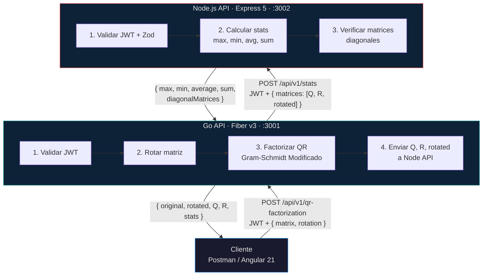
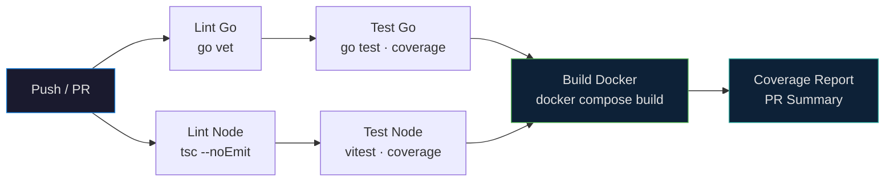

# Coding Challenge - Interseguro

Solucion tecnica del coding challenge de la Division TI de Interseguro. Sistema distribuido con dos APIs RESTful y un frontend Angular para rotacion de matrices, factorizacion QR y calculo de estadisticas.

## Arquitectura



## Stack

| Componente | Go API | Node API |
|---|---|---|
| Lenguaje | Go 1.25 | TypeScript 6 |
| Framework | Fiber v3 | Express 5.2 |
| Auth | golang-jwt/v5 | jsonwebtoken |
| Validacion | Manual | Zod 4 |
| Matematico | gonum v0.17 | N/A |
| HTTP Client | resty/v2 | N/A |
| Swagger | Embed HTML | Hardcoded Spec |
| Testing | go test | Vitest 4 |
| Coverage | 93.4% | 100% / 95.7% |

## Inicio Rapido

```bash
# Docker Compose (recomendado)
make up

# Desarrollo local
cd apps/go-api && JWT_SECRET=supersecret123 go run ./cmd/api
cd apps/node-api && npm run dev

# Tests
make test-all
```

## Endpoints

### Go API (puerto 3001)

| Metodo | Ruta | Auth |
|---|---|---|
| GET | `/health` | No |
| GET | `/swagger` | No |
| POST | `/api/v1/auth/login` | No |
| POST | `/api/v1/qr-factorization` | JWT |

### Node API (puerto 3002)

| Metodo | Ruta | Auth |
|---|---|---|
| GET | `/health` | No |
| GET | `/api-docs` | No |
| POST | `/api/v1/auth/login` | No |
| POST | `/api/v1/stats` | JWT |

## CI/CD

### Continuous Integration



El pipeline (`ci.yml`) ejecuta:
1. **Lint**: `go vet` (Go) + `tsc --noEmit` (Node)
2. **Test**: `go test` con coverage + `vitest` con coverage
3. **Build**: `docker compose build` de ambas imagenes
4. **Report**: Summary de cobertura en PR

### Continuous Deployment (a definir)

Opciones evaluadas para deploy cloud:

| Plataforma | Go API | Node API | Costo | Ideal para |
|---|---|---|---|---|
| **Fly.io** | Nativo | Nativo | ~$5/mes | Low-ops, global |
| **Railway** | Nativo | Nativo | ~$5/mes | DX rapido, simple |
| **Render** | Nativo | Nativo | Gratis (limitado) | Prototipos |
| **AWS ECS** | Docker | Docker | Variable | Enterprise |

**Recomendacion**: **Fly.io** para ambas APIs. Soporte nativo Go + Node, deploy con `fly deploy`, escalado automatico, y balanceo global. Railway como alternativa si se prefiere simplicidad de UI.

El CD se implementara en fase final una vez definida la plataforma.

## Estructura del Monorepo

```
apps/
  go-api/          # Go API · Fiber v3 · QR · Rotacion
  node-api/        # Node API · Express 5 · Stats · Zod
  frontend/        # Angular 21 · pendiente
docs/
  architecture.md  # Arquitectura completa + Mermaid
  specs/           # Especificaciones por servicio
  CODING_CONVENTIONS.md
.github/
  workflows/
    ci.yml         # CI pipeline
docker-compose.yml
Makefile
```

## Comandos

```bash
make help        # Lista todos los comandos
make up          # Iniciar todo con Docker
make down        # Detener todo
make test-all    # Tests Go + Node
make test-go     # Solo Go (coverage)
make test-node   # Solo Node (coverage)
make logs        # Logs de ambos servicios
```
