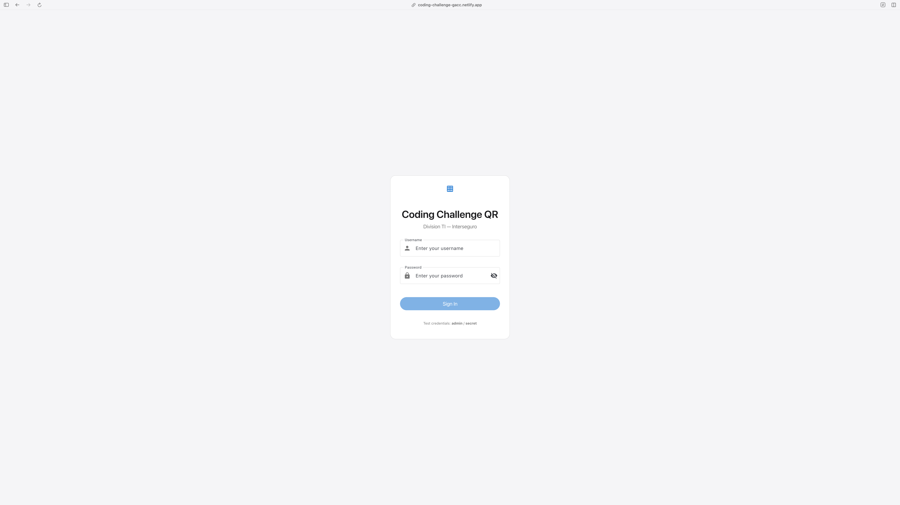
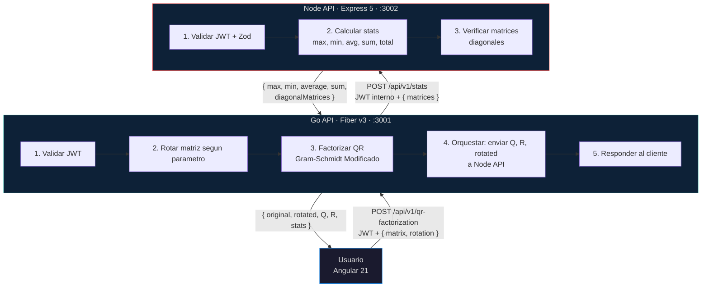
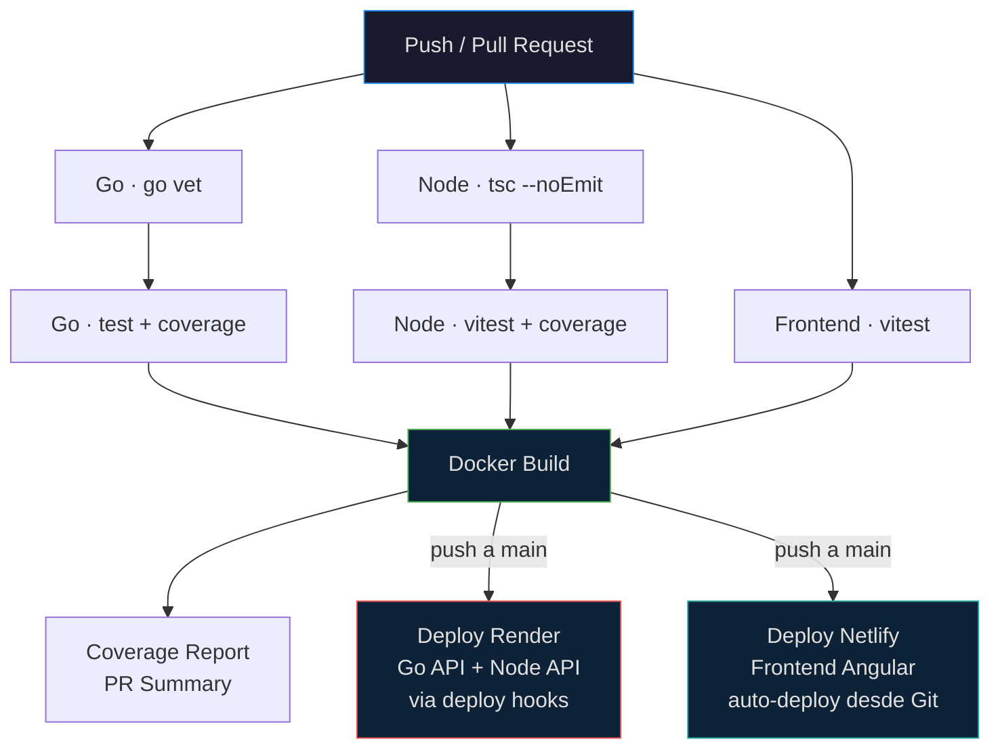

# Coding Challenge — Interseguro

Solucion tecnica del coding challenge de la Division TI de Interseguro. Sistema distribuido con dos APIs RESTful y un frontend Angular que implementa **rotacion de matrices**, **factorizacion QR** (Gram-Schmidt Modificado) y **calculo de estadisticas globales** con deteccion de matrices diagonales.

| Entorno | Frontend | Go API | Node API |
|---|---|---|---|
| **Produccion** | [netlify.app](https://coding-challenge-gacc.netlify.app) | [go-api-xnzb](https://go-api-xnzb.onrender.com) | [node-api-jqy3](https://node-api-jqy3.onrender.com) |
| **Local** | `http://localhost` | `http://localhost:3001` | `http://localhost:3002` |

### Credenciales de Prueba

| Campo | Valor |
|---|---|
| Username | `admin` |
| Password | `secret` |

> Validas para los endpoints `POST /api/v1/auth/login` de ambas APIs y para el login del frontend.

[](https://coding-challenge-gacc.netlify.app/login)

---

## Arquitectura



### Flujo de Datos

1. **Cliente** envia matriz + tipo de rotacion a la **Go API** con JWT de autenticacion
2. **Go API** valida el JWT, rota la matriz y ejecuta la factorizacion QR (Gram-Schmidt Modificado)
3. **Go API** envia las 3 matrices resultantes (Q, R, rotated) a la **Node API** usando un JWT interno
4. **Node API** valida con Zod, calcula estadisticas globales y detecta matrices diagonales
5. **Go API** recibe las estadisticas y retorna la respuesta completa al cliente

### Graceful Degradation

Si la Node API no responde, la Go API registra el error y retorna Q, R y la matriz rotada con `stats: null`. El servicio principal de factorizacion QR permanece operativo sin interrupcion.

---

## Stack Tecnologico

| Componente | Go API | Node API | Frontend |
|---|---|---|---|
| Lenguaje | Go 1.25 | TypeScript 5.9 | TypeScript 5.9 |
| Framework | Fiber v3 | Express 5.2 | Angular 21.2 |
| UI | — | — | Angular Material 3 + CDK |
| Estilos | — | — | SCSS · BEM · Gallery Aesthetic |
| Auth | golang-jwt/v5 | jsonwebtoken | AuthService + HttpInterceptorFn |
| Validacion | Manual | Zod 4 | Reactive Forms |
| Matematico | gonum v0.17 | — | — |
| QR Algorithm | Gram-Schmidt Modified | — | — |
| HTTP Client | resty/v2 | — | httpResource (signal-based) |
| Testing | go test | Vitest 4 | Vitest (via Angular builder) |
| Coverage | 93.4% | 100% / 95.7% | 100% / 100% |

---

## Endpoints

### Go API (puerto 3001)

| Metodo | Ruta | Auth | Descripcion |
|---|---|---|---|
| GET | `/health` | No | Health check |
| GET | `/swagger` | No | Swagger UI |
| POST | `/api/v1/auth/login` | No | Login · genera JWT |
| POST | `/api/v1/qr-factorization` | JWT | Rotacion + QR + Stats |

### Node API (puerto 3002)

| Metodo | Ruta | Auth | Descripcion |
|---|---|---|---|
| GET | `/health` | No | Health check |
| GET | `/api-docs` | No | Swagger UI |
| POST | `/api/v1/auth/login` | No | Login · genera JWT |
| POST | `/api/v1/stats` | JWT | Estadisticas de matrices |

### Frontend (SPA)

| Ruta | Acceso | Pantalla |
|---|---|---|
| `/login` | Publico | Login con credenciales |
| `/overview` | Privado | Vista general + accesos rapidos |
| `/input` | Privado | Formulario de matriz + rotacion |
| `/results` | Privado | Resultados Q, R, rotated + stats |

### Postman Collection

Coleccion completa con **21 requests** listos para importar y probar todas las APIs:

```
File → Import → docs/postman/interseguro-challenge.postman_collection.json
```

| Carpeta | Requests |
|---|---|
| Health Checks | Go API + Node API |
| Autenticacion | Login en ambas APIs (auto-guarda JWT) |
| Factorizacion QR | 8 requests: todas las rotaciones + identidad |
| Estadisticas | Stats directo a Node API |
| Validacion y Errores | 401, 400, 422 |
| Flujo Completo E2E | Login → QR con rotacion 90° |

> Las variables (`go_api_url`, `node_api_url`, `username`, `password`) vienen pre-configuradas para `localhost`. Los requests protegidos ejecutan login automatico si no hay token.
>
> Ver **[docs/POSTMAN_COLLECTION.md](docs/POSTMAN_COLLECTION.md)** para la documentacion completa de cada request.

---

## Rotacion de Matrices

Siete tipos de rotacion soportados, aplicados antes de la factorizacion QR:

| Valor | Descripcion |
|---|---|
| `none` | Sin rotacion |
| `clockwise_90` | 90° en sentido horario |
| `clockwise_180` | 180° |
| `clockwise_270` | 270° horario (90° antihorario) |
| `transpose` | Transposicion (filas ↔ columnas) |
| `horizontal_flip` | Espejo horizontal |
| `vertical_flip` | Espejo vertical |

---

## Algoritmo QR

La factorizacion QR se realiza mediante el metodo de **Gram-Schmidt Modificado** sobre la matriz rotada. Para una matriz A de dimensiones m×n (m ≥ n):

- **Q**: matriz m×n con columnas ortonormales
- **R**: matriz n×n triangular superior

La descomposicion satisface A = QR. Se valida que la matriz no sea singular (tolerancia 1×10⁻¹²). En caso de matrices rango-deficientes, se retorna error 422.

---

## Estadisticas

La Node API calcula sobre las 3 matrices recibidas (Q, R, rotated):

| Metrica | Descripcion |
|---|---|
| Max | Valor maximo global |
| Min | Valor minimo global |
| Average | Promedio de todos los elementos |
| Sum | Suma total |
| Total Elements | Cantidad de elementos |
| Diagonal Matrices | Matrices cuadradas con ceros fuera de la diagonal (tolerancia 1×10⁻¹⁰) |

---

## CI/CD

El pipeline de integracion y despliegue continuo esta implementado con **GitHub Actions** y se activa en cada push a `main` y pull request.



### Pipeline Stages

| Stage | Jobs | Detalle |
|---|---|---|
| **Lint** | `lint-go`, `lint-node` | `go vet`, `tsc --noEmit` |
| **Test** | `test-go`, `test-node`, `test-frontend` | Unit tests + coverage reports |
| **Build** | `build` | `docker compose build` de los 3 servicios |
| **Coverage** | `coverage-report` | PR summary con % de Go + Node |
| **Deploy** | `deploy-render`, Netlify auto-deploy | Solo en push a `main` |

### Deploy en Produccion

El proyecto se despliega en dos plataformas — **Netlify** para el frontend (static site) y **Render** para las APIs (web services). Ambas en plan gratuito ($0/mes).

```
Usuario → Netlify CDN → Angular SPA → Go API (Render) → Node API (Render)
                ↑                           |                     |
                └── index.html ─────────────┘                     |
                                   { Q, R, rotated }              |
                                                               { stats }
```

| Servicio | Plataforma | URL | Tipo |
|---|---|---|---|
| Frontend Angular | **Netlify** | [coding-challenge-gacc.netlify.app](https://coding-challenge-gacc.netlify.app) | Static Site · auto-deploy via Git |
| Go API | **Render** | [go-api-xnzb.onrender.com](https://go-api-xnzb.onrender.com) | Web Service · Docker |
| Node API | **Render** | [node-api-jqy3.onrender.com](https://node-api-jqy3.onrender.com) | Web Service · Docker |
| Swagger Go | Render | [go-api-xnzb.onrender.com/swagger](https://go-api-xnzb.onrender.com/swagger) | — |
| Swagger Node | Render | [node-api-jqy3.onrender.com/api-docs](https://node-api-jqy3.onrender.com/api-docs) | — |

### Netlify — Frontend

- **Build**: `npm ci && npm run build` desde `apps/frontend`
- **Output**: `dist/frontend/browser`
- **SPA Routing**: redirects `/*` → `/index.html` via `netlify.toml`
- **Auto-deploy**: cada push a `main` dispara build y deploy (~2 min)
- **Guia detallada**: [docs/deploy/frontend.md](docs/deploy/frontend.md)

### Render — Backend APIs

- **Build**: Docker multi-stage desde `apps/go-api/Dockerfile` y `apps/node-api/Dockerfile`
- **Deploy hooks**: GitHub Actions llama a las URLs de deploy de Render al mergear a `main`
- **Cold start**: el primer request tras inactividad tarda ~30s (free tier). Requests subsiguientes son instantaneos.
- **Guias detalladas**: [Go API](docs/deploy/go-api.md) · [Node API](docs/deploy/node-api.md)

### Notas de Produccion

- Las 3 APIs comparten el mismo `JWT_SECRET` para validacion de tokens
- **Included Paths** en Render: solo se redeploya si cambia su carpeta (`apps/go-api/**`, `apps/node-api/**`)
- Netlify usa `environment.production.ts` para la URL de la Go API
- Ambas APIs en Render usan la misma region (Oregon US West) para minimizar latencia

---

## Estructura del Monorepo

```
coding-challenge/
├── apps/
│   ├── go-api/              # Go API · Fiber v3 · QR · Rotacion
│   ├── node-api/            # Node API · Express 5 · Stats · Zod
│   └── frontend/            # Angular 21 · Material 3 · Gallery Aesthetic
├── docs/
│   ├── architecture.md      # Arquitectura detallada
│   ├── CODING_CONVENTIONS.md
│   ├── POSTMAN_COLLECTION.md
│   ├── Coding-Challenge.md  # Especificacion original
│   ├── deploy/              # Guias de deploy por servicio
│   └── specs/               # Especificaciones tecnicas
├── .github/workflows/
│   └── ci.yml               # Pipeline CI/CD
├── docker-compose.yml
├── docker-compose.dev.yml   # Hot-reload para desarrollo
├── netlify.toml              # Config de deploy Netlify
└── Makefile
```

---

## Despliegue Local

```bash
make up          # Construye e inicia los 3 servicios con Docker Compose
make dev         # Inicia con hot-reload (dev)
make down        # Detiene y remueve los contenedores
make test-all    # Ejecuta todos los tests
make logs        # Sigue los logs de todos los servicios
```

Servicios despues de `make up`:
- **Frontend**: http://localhost
- **Go API**: http://localhost:3001
- **Node API**: http://localhost:3002
- **Swagger Go**: http://localhost:3001/swagger
- **Swagger Node**: http://localhost:3002/api-docs

---

*Proyecto elaborado por **Gustavo Caqui** para el Coding Challenge de la Division TI — Interseguro. Mayo 2026.*
