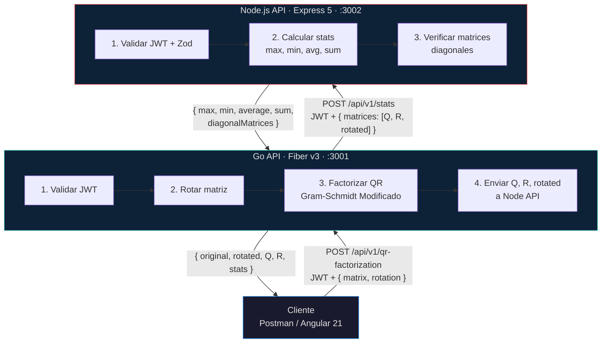
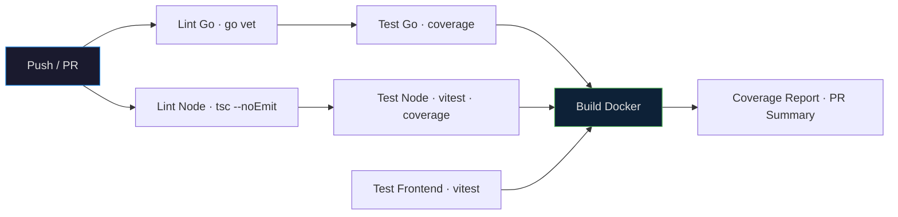

# Coding Challenge — Interseguro

Solucion tecnica del coding challenge de la Division TI de Interseguro. Sistema distribuido con dos APIs RESTful y un frontend Angular que implementa **rotacion de matrices**, **factorizacion QR** (Gram-Schmidt Modificado) y **calculo de estadisticas globales** con deteccion de matrices diagonales.

## Arquitectura



## Stack Tecnologico

| Componente | Go API | Node API | Frontend |
|---|---|---|---|
| Lenguaje | Go 1.25 | TypeScript 5.9 | TypeScript 5.9 |
| Framework | Fiber v3 | Express 5.2 | Angular 21.2 |
| UI | — | — | Angular Material 3 + CDK |
| Estilos | — | — | SCSS · BEM · Gallery Aesthetic |
| Auth | golang-jwt/v5 | jsonwebtoken | AuthService + HttpInterceptorFn |
| Validacion | Manual | Zod 4 | Reactive Forms |
| Matematico | gonum v0.17 | — | — |
| QR Algorithm | Gram-Schmidt Modified | — | — |
| HTTP Client | resty/v2 | — | httpResource (signal-based) |
| Stats Engine | — | Custom service | — |
| Swagger | Embed HTML | Hardcoded Spec | — |
| Testing | go test | Vitest 4 | Vitest (via Angular builder) |
| Coverage | 93.4% | 100% / 95.7% | 100% / 100% |

## Endpoints

### Go API (puerto 3001)

| Metodo | Ruta | Auth | Descripcion |
|---|---|---|---|
| GET | `/health` | No | Health check |
| GET | `/swagger` | No | Swagger UI |
| POST | `/api/v1/auth/login` | No | Login · JWT |
| POST | `/api/v1/qr-factorization` | JWT | Rotacion + QR + Stats |

### Node API (puerto 3002)

| Metodo | Ruta | Auth | Descripcion |
|---|---|---|---|
| GET | `/health` | No | Health check |
| GET | `/api-docs` | No | Swagger UI |
| POST | `/api/v1/auth/login` | No | Login · JWT |
| POST | `/api/v1/stats` | JWT | Estadisticas de matrices |

### Frontend (puerto 80)

| Ruta | Acceso | Pantalla |
|---|---|---|
| `/login` | Publico | Login con credenciales |
| `/overview` | Privado | Vista general + accesos rapidos |
| `/input` | Privado | Formulario de matriz + rotacion |
| `/results` | Privado | Resultados Q, R, rotated + stats |

## Rotacion de Matrices

Siete tipos de rotacion soportados, aplicados antes de la factorizacion QR:

| Valor | Descripcion |
|---|---|
| `none` | Sin rotacion |
| `clockwise_90` | 90° en sentido horario |
| `clockwise_180` | 180° |
| `clockwise_270` | 270° horario (90° antihorario) |
| `transpose` | Transposicion (filas ↔ columnas) |
| `horizontal_flip` | Espejo horizontal |
| `vertical_flip` | Espejo vertical |

## Algoritmo QR

La factorizacion QR se realiza mediante el metodo de **Gram-Schmidt Modificado** sobre la matriz rotada. Para una matriz A de dimensiones m×n (m ≥ n):

- **Q**: matriz m×n con columnas ortonormales
- **R**: matriz n×n triangular superior

La descomposicion satisface A = QR. Se valida que la matriz no sea singular (tolerancia 1×10⁻¹²). En caso de matrices rango-deficientes, se retorna error 422.

## Estadisticas

La Node API calcula sobre las 3 matrices recibidas (Q, R, rotated):

| Metrica | Descripcion |
|---|---|
| Max | Valor maximo global |
| Min | Valor minimo global |
| Average | Promedio de todos los elementos |
| Sum | Suma total |
| Total Elements | Cantidad de elementos |
| Diagonal Matrices | Matrices cuadradas con ceros fuera de la diagonal (tolerancia 1×10⁻¹⁰) |

## CI/CD



El pipeline CI ejecuta: lint, tests con coverage, build de imagenes Docker, y reporte de cobertura en PRs.

## Deploy

| Servicio | Plataforma | URL | Estado |
|---|---|---|---|
| Frontend Angular | Netlify | [coding-challenge-gacc.netlify.app](https://coding-challenge-gacc.netlify.app) | ✅ Live |
| Go API | Render | `https://go-api-xxxx.onrender.com` | ⏳ Pendiente |
| Node API | Render | `https://node-api-xxxx.onrender.com` | ⏳ Pendiente |

> Guias de deploy: [Frontend](docs/deploy/frontend.md) · [Go API](docs/deploy/go-api.md) · [Node API](docs/deploy/node-api.md)

## Estructura del Monorepo

```
coding-challenge/
├── apps/
│   ├── go-api/          # Go API · Fiber v3 · QR · Rotacion
│   ├── node-api/        # Node API · Express 5 · Stats · Zod
│   └── frontend/        # Angular 21 · Material 3 · Gallery Aesthetic
├── docs/
│   ├── architecture.md
│   ├── CODING_CONVENTIONS.md
│   └── specs/
├── .github/workflows/ci.yml
├── docker-compose.yml
└── Makefile
```

## Despliegue Local

```bash
make up          # Construye e inicia los 3 servicios con Docker Compose
make down        # Detiene y remueve los contenedores
make test-all    # Ejecuta todos los tests
make logs        # Sigue los logs de todos los servicios
```

Servicios despues de `make up`:
- **Frontend**: http://localhost
- **Go API**: http://localhost:3001
- **Node API**: http://localhost:3002
- **Swagger Go**: http://localhost:3001/swagger
- **Swagger Node**: http://localhost:3002/api-docs

---

*Proyecto elaborado por **Gustavo Caqui** para el Coding Challenge de la Division TI — Interseguro. Mayo 2026.*
