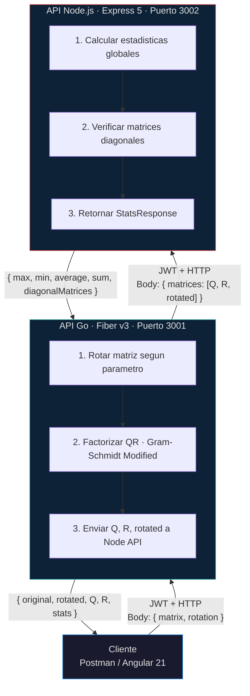

# Arquitectura del Sistema

**Coding Challenge — Division TI Interseguro**

---

## 1. Vision General

Sistema distribuido compuesto por dos APIs RESTful y un frontend SPA que implementan rotacion de matrices, factorizacion QR y calculo de estadisticas. La comunicacion entre APIs se realiza mediante HTTP con autenticacion JWT compartida.

### Diagrama de Arquitectura



### Flujo de Datos

1. **Cliente** envia matriz + rotacion a la **Go API** con JWT
2. **Go API** valida JWT, rota la matriz, ejecuta factorizacion QR
3. **Go API** envia Q, R, rotated a la **Node API** con JWT interno
4. **Node API** calcula estadisticas sobre las 3 matrices y retorna a Go
5. **Go API** retorna `{ original, rotated, Q, R, stats }` al cliente

### Manejo de Errores (Graceful Degradation)

Si la Node API no responde, la Go API registra el error, retorna Q, R y matriz rotada sin estadisticas, y mantiene la disponibilidad del servicio principal.

---

## 2. Seguridad (JWT)

- **Algoritmo**: HS256
- **Shared Secret**: `JWT_SECRET` (variable de entorno, compartida entre ambas APIs)
- **Duracion del token**: 1 hora
- **Endpoints protegidos**: `POST /api/v1/qr-factorization`, `POST /api/v1/stats`

La Go API genera un token interno (`sub: "go-api-internal"`) para comunicarse con la Node API. Ambas APIs validan el token contra el mismo secret compartido.

---

## 3. Rotacion de Matrices

Siete tipos de rotacion aplicados antes de la factorizacion QR:

| Valor | Descripcion |
|---|---|
| `none` | Sin rotacion |
| `clockwise_90` | 90° horario |
| `clockwise_180` | 180° |
| `clockwise_270` | 270° horario (90° antihorario) |
| `transpose` | Transposicion (filas ↔ columnas) |
| `horizontal_flip` | Espejo horizontal |
| `vertical_flip` | Espejo vertical |

---

## 4. Algoritmo QR

### Metodo: Gram-Schmidt Modificado

Para una matriz A de dimensiones m×n (m ≥ n), se computa la descomposicion A = QR donde Q es ortonormal (m×n) y R es triangular superior (n×n).

El algoritmo itera sobre cada columna de A, ortogonalizando contra las columnas previas de Q mediante productos punto, y normalizando para obtener cada columna de Q. Los coeficientes de ortogonalizacion se almacenan en R.

### Validaciones

- La matriz no puede estar vacia
- Las filas deben ser consistentes (misma cantidad de columnas)
- Se requiere m ≥ n (rows ≥ columns)
- Se verifica que R[j][j] > 1×10⁻¹² para detectar matrices singulares

---

## 5. Estadisticas

La Node API recibe 3 matrices (Q, R, rotated) y calcula:

| Metrica | Descripcion |
|---|---|
| `max` | Valor maximo global entre todas las matrices |
| `min` | Valor minimo global |
| `average` | Promedio de todos los elementos |
| `sum` | Suma total de elementos |
| `totalElements` | Cantidad total de elementos |
| `numberOfMatrices` | Cantidad de matrices procesadas |
| `diagonalMatrices` | Deteccion de matrices cuadradas cuyos elementos fuera de la diagonal son ≈ 0 (tolerancia 1×10⁻¹⁰) |

---

## 6. Arquitectura del Frontend

El frontend sigue el patron **Container/Presentational** (Smart/Dumb):

- **Smart Components** (Containers): `LoginPage`, `OverviewPage`, `InputPage`, `ResultsPage`. Orquestan servicios, estado y navegacion.
- **Dumb Components** (Presentational): `MatrixDisplay`, `StatsPanel`, `RotationSelector`, `LoadingSpinner`, `ErrorAlert`. Reciben datos via `input()`, emiten via `output()`.

### Diseno: Gallery Aesthetic

Sistema de diseno photography-first con paleta monocromatica neutra, tipografia Inter, un solo acento Action Blue (#0066cc), y tiles full-bleed que alternan fondos claros y oscuros. Sin gradientes decorativos ni sombras en elementos UI.

---

## 7. Stack Tecnologico

### Go API

| Componente | Tecnologia | Version |
|---|---|---|
| Lenguaje | Go | 1.25 |
| Framework HTTP | Fiber | v3 |
| Libreria matematica | gonum | v0.17.0 |
| JWT | golang-jwt/jwt | v5 |
| HTTP Client | resty | v2 |
| Env vars | godotenv | v1.5.1 |
| Swagger | HTML embebido via go:embed | — |
| Testing | testing (stdlib) | — |

### Node API

| Componente | Tecnologia | Version |
|---|---|---|
| Runtime | Node.js | 20 |
| Framework | Express | 5.2.1 |
| Lenguaje | TypeScript | 5.9.2 |
| Validacion | Zod | 4.4.3 |
| JWT | jsonwebtoken | 9.0.3 |
| Testing | Vitest | 4.1.5 |
| HTTP Testing | supertest | 7.2.2 |

### Frontend

| Componente | Tecnologia | Version |
|---|---|---|
| Framework | Angular | 21.2 |
| UI | Angular Material 3 + CDK | 21.2.10 |
| Lenguaje | TypeScript | 5.9.2 |
| Estilos | SCSS · BEM | — |
| HTTP | httpResource (signal-based) | — |
| Testing | Vitest (via Angular builder) | 4.0.8 |

### Infraestructura

| Componente | Tecnologia |
|---|---|
| Contenerizacion | Docker (multi-stage builds) |
| Orquestacion local | Docker Compose |
| CI | GitHub Actions |
| Frontend server | NGINX (alpine) |

---

## 8. Estructura del Monorepo

```
coding-challenge/
├── apps/
│   ├── go-api/
│   │   ├── cmd/api/           # Entry point · Fiber app + Swagger embed
│   │   ├── internal/
│   │   │   ├── config/        # Env config
│   │   │   ├── handlers/      # HTTP handlers
│   │   │   ├── middleware/     # JWT, validation, logger, recover
│   │   │   ├── models/        # DTOs
│   │   │   └── services/      # QR service, Node client
│   │   ├── pkg/matrix/        # Rotaciones + QR factorization
│   │   └── tests/
│   │
│   ├── node-api/
│   │   ├── src/
│   │   │   ├── config/
│   │   │   ├── controllers/
│   │   │   ├── middleware/
│   │   │   ├── routes/
│   │   │   ├── services/      # Stats service, Auth service
│   │   │   ├── schemas/       # Zod schemas
│   │   │   └── types/
│   │   └── tests/unit/
│   │
│   └── frontend/
│       ├── src/app/
│       │   ├── core/          # Auth, HTTP, models, state
│       │   ├── features/      # Login, Overview, Input, Results
│       │   └── shared/        # Dumb components
│       └── src/styles/        # SCSS variables, mixins, typography
│
├── docs/                      # Documentacion
├── .github/workflows/ci.yml   # CI pipeline
├── docker-compose.yml
└── Makefile
```

---

## 9. Docker Compose

Tres servicios orquestados en red `challenge-network`:

| Servicio | Puerto | Descripcion |
|---|---|---|
| `go-api` | 3001 | API Go · Rotacion + QR |
| `node-api` | 3002 | API Node.js · Estadisticas |
| `frontend` | 80 | Angular 21 · NGINX |

Cada servicio usa build multi-stage para optimizar el tamano de la imagen final.

---

## 10. Variables de Entorno

| Variable | Default | Descripcion |
|---|---|---|
| `PORT` | 3001 / 3002 | Puerto HTTP |
| `JWT_SECRET` | `supersecret123` | Secret compartido para JWT |
| `JWT_EXPIRATION` | `3600` | Duracion del token en segundos |
| `AUTH_USERNAME` | `admin` | Usuario para login |
| `AUTH_PASSWORD` | `secret` | Contrasena para login |
| `NODE_API_URL` | `http://node-api:3002` | URL de la Node API (Go API) |
| `CORS_ORIGIN` | `*` | Origen permitido para CORS |
| `NODE_ENV` | `development` | Entorno de ejecucion |

---

## 11. Decisiones Tecnicas

### ¿Por que gonum?

Libreria cientifica para Go con operaciones matriciales optimizadas. Proporciona estructuras de datos y algoritmos para algebra lineal. Aunque se evaluo `mat.QR` nativo de gonum (Householder), se implemento Gram-Schmidt Modificado manual para mayor control sobre la deteccion de matrices singulares y el formato de salida.

### ¿Por que Gram-Schmidt Modificado?

El metodo de Gram-Schmidt Modificado ofrece mejor estabilidad numerica que el Gram-Schmidt clasico al re-ortogonalizar cada vector contra los previos en cada iteracion. Es adecuado para matrices bien condicionadas y produce resultados precisos para el rango de entradas del challenge.

### ¿Por que Node.js para estadisticas?

Separacion de responsabilidades: Go maneja el computo numerico intensivo (QR), mientras Node.js maneja la logica de negocio de estadisticas con un stack mas productivo para este tipo de tareas (TypeScript + Zod).

### ¿Por que Angular 21?

- Signals nativos para reactividad sin RxJS
- httpResource para fetch HTTP basado en signals con estados de loading/error
- Angular Material 3 con componentes accesibles
- Standalone components sin NgModules
- Vitest integrado via Angular builder

### ¿Por que Vitest?

Testing moderno con ESM nativo, API compatible con Jest, ejecucion mas rapida gracias a Vite, y soporte nativo de TypeScript sin configuracion adicional. Angular 21 lo integra directamente via `@angular/build:unit-test`.

### ¿Por que Zod en Node.js?

Validacion declarativa con inferencia automatica de tipos TypeScript. Schemas composables y reutilizables. Errores detallados con path exacto del campo invalido. Tamanio de bundle significativamente menor que alternativas como Joi.

### ¿Por que diseno Gallery Aesthetic?

Enfoque photography-first donde la UI retrocede para que el contenido hable. Un solo acento de color, sin gradientes ni sombras decorativas, tipografia con tracking negativo, y tiles full-bleed que alternan fondos claros y oscuros como divisor natural entre secciones.

---

## 12. Cobertura de Tests

| API | Statements | Branches | Functions | Lines |
|---|---|---|---|---|
| Go API | — | — | — | 93.4% |
| Node API | 100% | 95.7% | 100% | 100% |
| Frontend | 100% | 100% | 100% | 100% |

---

*Documento version 4.0 — Mayo 2026*
