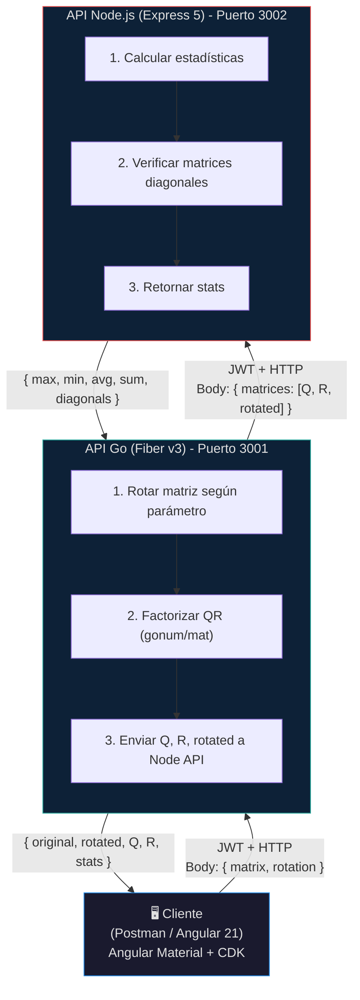

# Arquitectura del Monorepo - Coding Challenge Interseguro

**División TI - Junio 2024**

---

## 1. Visión General

Este proyecto implementa una solución técnica compuesta por **dos APIs RESTful** y un **frontend en Angular 21** que trabajan en conjunto para realizar **rotación de matrices**, **factorización QR** y calcular **estadísticas** sobre los resultados. La comunicación entre APIs se realiza mediante HTTP con autenticación JWT.

### Diagrama de Arquitectura



### Flujo de Datos

1. **Cliente** (Postman / Angular 21) envía matriz + rotación a **API Go** con JWT
2. **API Go** valida JWT → **Rota matriz** → **Factoriza QR** (gonum/mat)
3. **API Go** envía Q, R, rotated a **API Node.js** con JWT
4. **API Node.js** calcula estadísticas sobre las 3 matrices → Retorna a Go
5. **API Go** retorna `{ Q, R, rotated, rotation, original, stats }` al Cliente

---

## 2. Estructura del Monorepo

```
coding-challenge/
│
├── 📁 docs/                              # Documentación del proyecto
│   ├── architecture.md                   # Arquitectura general (este archivo)
│   ├── Coding-Challenge.md               # Enunciado original en markdown
│   └── specs/
│       ├── go-api/
│       │   └── README.md                 # Especificación API Go
│       ├── node-api/
│       │   └── README.md                 # Especificación API Node.js
│       └── frontend.md                   # Especificación Frontend
│
├── 📁 apps/                              # Aplicaciones
│   ├── 📁 go-api/                        # API Go (Rotación + QR)
│   │   ├── cmd/api/main.go
│   │   ├── internal/
│   │   │   ├── config/
│   │   │   ├── handlers/
│   │   │   ├── middleware/
│   │   │   ├── models/
│   │   │   └── services/
│   │   ├── pkg/
│   │   │   └── matrix/                   # Operaciones con gonum/mat
│   │   ├── tests/
│   │   ├── go.mod
│   │   ├── go.sum
│   │   ├── Dockerfile
│   │   └── .dockerignore
│   │
│   ├── 📁 node-api/                      # API Node.js (Estadísticas)
│   │   ├── src/
│   │   │   ├── app.ts                    # Clase App (inicialización)
│   │   │   ├── index.ts                  # Punto de entrada
│   │   │   ├── config/
│   │   │   ├── controllers/
│   │   │   ├── middleware/
│   │   │   ├── models/
│   │   │   ├── routes/
│   │   │   ├── services/
│   │   │   ├── types/
│   │   │   └── schemas/                  # Zod schemas
│   │   ├── tests/
│   │   │   └── unit/
│   │   ├── vitest.config.ts              # Config Vitest
│   │   ├── package.json
│   │   ├── tsconfig.json
│   │   ├── Dockerfile
│   │   └── .dockerignore
│   │
│   └── 📁 frontend/                      # Frontend Angular 21
│       ├── src/
│       │   ├── app/
│       │   │   ├── components/
│       │   │   ├── services/
│       │   │   ├── guards/
│       │   │   ├── interceptors/
│       │   │   └── models/
│       │   ├── environments/
│       │   └── styles/
│       ├── angular.json
│       ├── package.json
│       ├── tsconfig.json
│       └── Dockerfile
│
├── 📁 .github/
│   └── workflows/
│       └── ci.yml                        # GitHub Actions CI/CD
│
├── docker-compose.yml                    # Orquestación local
├── Makefile                              # Comandos comunes
├── .gitignore
└── README.md
```

---

## 3. Stack Tecnológico

### API Go (Rotación + Factorización QR)

| Componente | Tecnología | Versión | Justificación |
|------------|-----------|---------|---------------|
| Lenguaje | Go | 1.23+ | Rendimiento, concurrencia |
| Framework | Fiber | v3 | Última versión, ultra rápido |
| Matemático | gonum | v0.17.0 | Librería científica para Go. Acelera operaciones matriciales |
| JWT | golang-jwt/jwt | v5.2.0 | Estándar JWT en Go |
| Env Vars | godotenv | v1.5.1 | Cargar `.env` |
| HTTP Client | go-resty/resty | v2.16.0 | Cliente HTTP moderno |
| Swagger | swaggo/swag + gofiber/swagger | v1.16+ / v1.1+ | Documentación OpenAPI con anotaciones en comentarios Go |
| Testing | testing | Built-in | Framework nativo |

### API Node.js (Estadísticas)

| Componente | Tecnología | Versión | Justificación |
|------------|-----------|---------|---------------|
| Runtime | Node.js | 20+ (modo strict ESM) | Moderno, estable |
| Framework | Express | ^5.2.1 | Estándar, clase-based, mejor manejo async |
| Lenguaje | TypeScript | ^6.0.3 | Última versión |
| Validación | Zod | ^4.4.3 | Schemas tipados, inferencia TS, pipeline API |
| JWT | jsonwebtoken | ^9.0.3 | Estándar JWT |
| CORS | cors | ^2.8.6 | Cross-origin |
| Env Vars | dotenv | ^17.4.2 | Variables entorno |
| Swagger | swagger-jsdoc + swagger-ui-express | ^6.2.8 / ^5.0.1 | Documentación OpenAPI con JSDoc |
| Testing | Vitest | ^4.1.5 | Nativo ESM, rápido |
| HTTP Testing | supertest | ^7.2.2 | Testing endpoints |

### Frontend (Angular 21)

| Componente | Tecnología | Versión | Justificación |
|------------|-----------|---------|---------------|
| Framework | Angular | v21 | Última versión con signals, httpResource |
| UI | Angular Material | v21 | Componentes accesibles, CDK |
| CDK | @angular/cdk | v21 | Drag-drop, overlays, a11y |
| Lenguaje | TypeScript | ^6.0.3 | Última versión |
| Estilos | SCSS | Built-in | Variables, mixins, nesting |
| HTTP | httpResource | Built-in | Signal-based HTTP |
| Forms | Signal Forms | Built-in | Forms reactivos con signals |
| Testing | Vitest | Built-in | Viene por defecto en Angular 21 |
| Component Testing | @angular/testing | Built-in | TestBed, harnesses |

### Infraestructura y CI/CD

| Componente | Tecnología | Versión | Justificación |
|------------|-----------|---------|---------------|
| Contenerización | Docker | Latest | Contenedores |
| Orquestación | Docker Compose | 3.8 | Multi-servicio |
| CI/CD | GitHub Actions | Latest | Integración GitHub |
| Test Runner | Vitest | ^4.1.5 | Para Node.js y Angular |
| Local Dev | Bun | Latest | Más rápido que npm/node |

---

## 4. Comunicación entre APIs

### Flujo de Peticiones

```mermaid
sequenceDiagram
    participant Client as Cliente
    participant GoAPI as API Go (Fiber v3)
    participant NodeAPI as API Node.js (Express 5)

    Client->>GoAPI: POST /api/v1/qr-factorization<br/>Authorization: Bearer &lt;jwt&gt;<br/>{ matrix, rotation }
    GoAPI->>GoAPI: Validar JWT
    GoAPI->>GoAPI: Rotar matriz (clockwise_90)
    GoAPI->>GoAPI: Factorizar QR (gonum/mat)
    GoAPI->>NodeAPI: POST /api/v1/stats<br/>Authorization: Bearer &lt;jwt&gt;<br/>{ matrices: [Q, R, rotated] }
    NodeAPI->>NodeAPI: Validar JWT
    NodeAPI->>NodeAPI: Calcular stats + verificar diagonal
    NodeAPI-->>GoAPI: { max, min, average, sum, diagonals }
    GoAPI-->>Client: { original, rotated, rotation, Q, R, stats }
```

### Manejo de Errores (Graceful Degradation)

Si la API Node.js no responde, la API Go:
1. Logea el error
2. Retorna Q, R y matriz rotada sin estadísticas
3. Mantiene disponibilidad del servicio principal

---

## 5. Rotación de Matrices

| Valor | Descripción | Ejemplo 2x3 |
|-------|-------------|-------------|
| `none` | Sin rotación | `[[1,2,3],[4,5,6]]` |
| `clockwise_90` | 90° horario | `[[4,1],[5,2],[6,3]]` |
| `clockwise_180` | 180° | `[[6,5,4],[3,2,1]]` |
| `clockwise_270` | 270° horario | `[[3,6],[2,5],[1,4]]` |
| `transpose` | Transposición | `[[1,4],[2,5],[3,6]]` |
| `horizontal_flip` | Volteo horizontal | `[[3,2,1],[6,5,4]]` |
| `vertical_flip` | Volteo vertical | `[[4,5,6],[1,2,3]]` |

### Documentación Swagger

Ambas APIs exponen Swagger UI para documentación interactiva:

| API | Ruta Swagger | Framework | Generación Spec |
|-----|-------------|-----------|-----------------|
| Go API | `GET /swagger/*` | `gofiber/swagger` | `swaggo/swag` (anotaciones en comentarios Go) |
| Node API | `GET /api-docs` | `swagger-ui-express` | `swagger-jsdoc` (JSDoc anotaciones) |

- **Go API Swagger UI**: `http://localhost:3001/swagger/index.html`
- **Node API Swagger UI**: `http://localhost:3002/api-docs`
- **Go API OpenAPI JSON**: `http://localhost:3001/swagger/doc.json`
- **Node API OpenAPI JSON**: `http://localhost:3002/api-docs.json`

---

## 7. Seguridad (JWT)

- **Algoritmo**: HS256
- **Shared Secret**: `JWT_SECRET`
- **Duración**: 1 hora
- **Endpoints protegidos**: `POST /api/v1/qr-factorization`, `POST /api/v1/stats`

---

## 7. Estrategia Docker

### Dockerfile Go API (Multi-stage)

```dockerfile
FROM golang:1.23-alpine AS builder
WORKDIR /app
COPY go.mod go.sum ./
RUN go mod download
COPY . .
RUN CGO_ENABLED=0 GOOS=linux go build -o main ./cmd/api

FROM alpine:latest
RUN apk --no-cache add ca-certificates
WORKDIR /root/
COPY --from=builder /app/main .
EXPOSE 3001
CMD ["./main"]
```

### Dockerfile Node.js API (Multi-stage)

```dockerfile
FROM node:20-alpine AS builder
WORKDIR /app
COPY package*.json ./
RUN npm ci
COPY . .
RUN npm run build

FROM node:20-alpine
WORKDIR /app
COPY --from=builder /app/dist ./dist
COPY --from=builder /app/node_modules ./node_modules
COPY package*.json ./
EXPOSE 3002
CMD ["npm", "start"]
```

### Dockerfile Frontend Angular (Multi-stage)

```dockerfile
FROM node:20-alpine AS builder
WORKDIR /app
COPY package*.json ./
RUN npm ci
COPY . .
RUN npm run build

FROM nginx:alpine
COPY --from=builder /app/dist/frontend/browser /usr/share/nginx/html
COPY nginx.conf /etc/nginx/conf.d/default.conf
EXPOSE 80
CMD ["nginx", "-g", "daemon off;"]
```

### Docker Compose

```yaml
version: '3.8'
services:
  go-api:
    build: ./apps/go-api
    ports: ["3001:3001"]
    environment:
      - PORT=3001
      - NODE_API_URL=http://node-api:3002
      - JWT_SECRET=${JWT_SECRET}
    networks: [challenge-network]

  node-api:
    build: ./apps/node-api
    ports: ["3002:3002"]
    environment:
      - PORT=3002
      - JWT_SECRET=${JWT_SECRET}
      - NODE_ENV=production
    networks: [challenge-network]

  frontend:
    build: ./apps/frontend
    ports: ["80:80"]
    networks: [challenge-network]

networks:
  challenge-network:
    driver: bridge
```

---

## 8. CI/CD (GitHub Actions)

```yaml
name: CI/CD Pipeline

on:
  push:
    branches: [main, develop]
  pull_request:
    branches: [main]

jobs:
  test-go:
    runs-on: ubuntu-latest
    steps:
      - uses: actions/checkout@v4
      - uses: actions/setup-go@v5
        with: { go-version: '1.23' }
      - run: cd apps/go-api && go test ./... -v -cover

  test-node:
    runs-on: ubuntu-latest
    steps:
      - uses: actions/checkout@v4
      - uses: actions/setup-node@v4
        with: { node-version: '20' }
      - run: cd apps/node-api && npm ci && npm run test -- --coverage

  test-frontend:
    runs-on: ubuntu-latest
    steps:
      - uses: actions/checkout@v4
      - uses: actions/setup-node@v4
        with: { node-version: '20' }
      - run: cd apps/frontend && npm ci && npm run test -- --coverage

  build-docker:
    runs-on: ubuntu-latest
    needs: [test-go, test-node, test-frontend]
    steps:
      - uses: actions/checkout@v4
      - run: docker-compose build
```

---

## 9. Variables de Entorno

```bash
# JWT (compartido entre APIs)
JWT_SECRET=super-secret-key-cambiar-en-produccion

# Go API
GO_API_PORT=3001
NODE_API_URL=http://node-api:3002

# Node API
NODE_API_PORT=3002
NODE_ENV=development

# Auth (desarrollo)
AUTH_USERNAME=admin
AUTH_PASSWORD=secret
```

---

## 10. Plan de Implementación

| Fase | Tarea | Prioridad |
|------|-------|-----------|
| **Fase 1** | Setup monorepo + configs | Alta |
| **Fase 2** | API Go (Fiber v3, gonum, rotación, QR, JWT) | Alta |
| **Fase 3** | API Node.js (Express + TS, clases, Zod, JWT, stats, Vitest) | Alta |
| **Fase 4** | Docker (Dockerfiles, docker-compose) | Alta |
| **Fase 5** | Frontend Angular 21 (Material, CDK, SCSS, Signals) | Media |
| **Fase 6** | Postman collection + integración | Media |
| **Fase 7** | GitHub Actions (CI/CD) | Media |

---

## 11. Decisiones Técnicas

### ¿Por qué gonum?
- **Performance**: Operaciones matriciales optimizadas en C via BLAS/LAPACK
- **Factorización QR nativa**: `mat.QR` implementado con Householder
- **Multiplicación rápida**: `mat.Mul` usa algoritmos optimizados
- **Cálculos vectoriales**: Operaciones con vectores y normas

### ¿Por qué Angular 21?
- **Signals nativos**: Reactividad sin RxJS para casos simples
- **httpResource**: Fetch HTTP basado en signals, loading/error states
- **Angular Material + CDK**: Componentes accesibles, lista para producción
- **Vitest por defecto**: Testing moderno sin configuración extra
- **Standalone components**: Sin NgModules, imports directos

### ¿Por qué Vitest?
- **Más rápido que Jest**: Hot Module Replacement en tests
- **ESM nativo**: Compatible con ESM sin configuración extra
- **API compatible con Jest**: Fácil migración
- **Angular 21 lo usa por defecto**: Integración nativa

### ¿Por qué Zod en Node.js?
- **Tipado inferido**: `z.infer<typeof schema>` genera tipos TS
- **Validación declarativa**: Schemas reutilizables y composables
- **Errores detallados**: Mensajes de error con path exacto

### ¿Por qué clases en Node.js?
- **Inyección de dependencias**: Constructor injection
- **Testabilidad**: Fácil mockeo de dependencias
- **Consistencia**: Mismo patrón en controllers, services, routes

---

## 12. Checklist

- [ ] Tests Go pasan
- [ ] Tests Node.js (Vitest) pasan
- [ ] Tests Angular (Vitest) pasan
- [ ] Docker Compose funcional
- [ ] Health checks responden
- [ ] JWT funciona
- [ ] Rotación funciona
- [ ] QR con gonum funciona
- [ ] CI/CD en GitHub Actions

---

**Documento versión**: 3.0  
**Última actualización**: Junio 2024  
**Autor**: División TI - Interseguro
