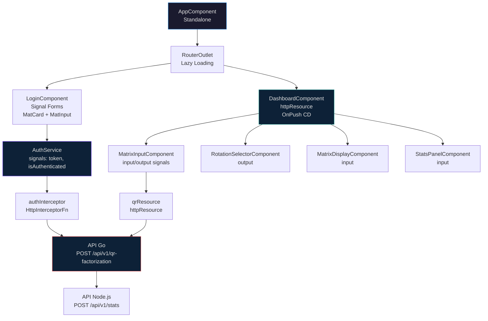
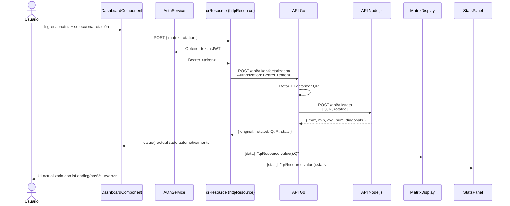
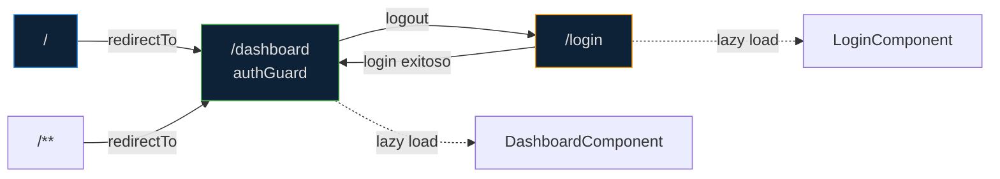

# Especificación Frontend - Angular 21

**Fase**: 3 (Opcional pero planificada)  
**Framework**: Angular 21  
**UI**: Angular Material + CDK  
**Estilos**: SCSS con variables y mixins  
**Testing**: Vitest (incluido por defecto en Angular 21)  
**HTTP**: httpResource (signal-based)  
**Forms**: Signal Forms

---

## 1. Visión General

El frontend en Angular 21 proporciona una interfaz moderna con **Angular Material** para consumir la API Go y visualizar la rotación de matrices, factorización QR y estadísticas.

### Diagrama de Componentes



### Flujo de Datos (Sequence)



### Pantallas Principales

1. **Login**: Autenticación JWT
2. **Dashboard**: Ingreso de matriz + selector de rotación
3. **Resultados**: Visualización de Q, R, rotated y estadísticas

---

## 2. Dependencias

### Production

| Librería | Versión | Justificación |
|----------|---------|---------------|
| `@angular/core` | ^21.0.0 | Framework principal. Signals, httpResource, standalone components |
| `@angular/common` | ^21.0.0 | Directivas comunes, NgOptimizedImage |
| `@angular/router` | ^21.0.0 | Routing lazy-loaded |
| `@angular/material` | ^21.0.0 | Componentes Material Design accesibles |
| `@angular/cdk` | ^21.0.0 | Component Dev Kit (overlays, a11y, drag-drop) |
| `@angular/forms` | ^21.0.0 | Signal Forms para formularios reactivos |

### Dev

| Librería | Versión | Justificación |
|----------|---------|---------------|
| `typescript` | ^6.0.3 | Última versión |
| `@angular/cli` | ^21.0.0 | CLI para scaffolding y build |
| `sass` | ^1.86.0 | Compilador SCSS |

**Nota**: No se necesita `axios`. Angular 21 usa `httpResource()` que es nativo y basado en signals.

---

## 3. Estructura de Carpetas

```
apps/frontend/
│
├── public/
│   └── favicon.ico
│
├── src/
│   ├── index.html                        # HTML principal con Material fonts
│   ├── main.ts                           # Bootstrap con appConfig
│   ├── app.config.ts                     # Config providers (httpClient, router)
│   │
│   ├── app/
│   │   ├── app.component.ts              # Componente raíz (standalone)
│   │   ├── app.component.html
│   │   ├── app.component.scss
│   │   ├── app.routes.ts                 # Definición de rutas lazy-loaded
│   │   │
│   │   ├── core/
│   │   │   ├── auth/
│   │   │   │   ├── auth.service.ts       # Servicio de autenticación (signals)
│   │   │   │   ├── auth.guard.ts         # Guard de rutas con JWT
│   │   │   │   └── auth.interceptor.ts   # Interceptor HTTP para JWT
│   │   │   └── models/
│   │   │       ├── matrix.model.ts       # Interfaces Matrix, StatsResponse
│   │   │       └── auth.model.ts         # Interfaces Auth
│   │   │
│   │   ├── features/
│   │   │   ├── login/
│   │   │   │   ├── login.component.ts    # Login con Signal Forms
│   │   │   │   ├── login.component.html
│   │   │   │   └── login.component.scss
│   │   │   │
│   │   │   └── dashboard/
│   │   │       ├── dashboard.component.ts    # Dashboard principal
│   │   │       ├── dashboard.component.html
│   │   │       ├── dashboard.component.scss
│   │   │       └── components/
│   │   │           ├── matrix-input.component.ts      # Input de matriz dinámico
│   │   │           ├── matrix-display.component.ts    # Tabla HTML de matriz
│   │   │           ├── rotation-selector.component.ts # Selector de rotación
│   │   │           └── stats-panel.component.ts       # Cards de estadísticas
│   │   │
│   │   └── shared/
│   │       ├── components/
│   │       │   ├── loading-spinner.component.ts
│   │       │   └── error-alert.component.ts
│   │       └── material.module.ts        # Imports de Material centralizados
│   │
│   ├── environments/
│   │   ├── environment.ts                # Dev: localhost:3001
│   │   └── environment.prod.ts           # Prod: URLs de producción
│   │
│   └── styles/
│       ├── _variables.scss               # Variables SCSS globales
│       ├── _mixins.scss                  # Mixins reutilizables
│       ├── _theme.scss                   # Tema Angular Material
│       └── styles.scss                   # Estilos globales
│
├── angular.json                          # Config Angular CLI
├── package.json
├── tsconfig.json
├── tsconfig.app.json
├── tsconfig.spec.json                    # Config TypeScript para tests
├── vitest.config.ts                      # Config Vitest
└── Dockerfile
```

---

## 4. Angular Material + CDK

### Tema Personalizado (`_theme.scss`)

```scss
@use '@angular/material' as mat;

$primary: mat.m3-define-palette(mat.$blue-palette, 600);
$accent: mat.m3-define-palette(mat.$teal-palette, 400);
$warn: mat.m3-define-palette(mat.$red-palette, 500);

$theme: mat.m3-define-light-theme((
  color: (
    primary: $primary,
    accent: $accent,
    warn: $warn,
  ),
  typography: mat.m3-define-typography-config(),
  density: 0,
));

@include mat.all-component-themes($theme);
```

### Variables SCSS (`_variables.scss`)

```scss
$primary: #1e88e5;
$accent: #26a69a;
$warn: #ef5350;
$dark-bg: #1a1a2e;
$surface: #16213e;
$text-primary: #e0e0e0;
$text-secondary: #b0b0b0;
$border-radius: 8px;
$transition: all 0.3s ease;
```

### Componentes Material a Usar

| Componente | Selector | Uso |
|-----------|----------|-----|
| `MatCard` | `<mat-card>` | Contenedores de resultado |
| `MatFormField` | `<mat-form-field>` | Inputs de formulario |
| `MatInput` | `<input matInput>` | Campos de texto |
| `MatSelect` | `<mat-select>` | Selector de rotación |
| `MatButton` | `<button mat-button>` | Botones |
| `MatIcon` | `<mat-icon>` | Íconos Material |
| `MatToolbar` | `<mat-toolbar>` | Header/nav |
| `MatProgressSpinner` | `<mat-spinner>` | Loading states |
| `MatSnackBar` | Servicio | Notificaciones toast |
| `MatTable` | `<mat-table>` | Visualización de matrices |
| `MatGridList` | `<mat-grid-list>` | Layout de stats |
| `MatTooltip` | `matTooltip` | Tooltips en íconos |

---

## 5. Rutas (Lazy Loading)



```typescript
// app.routes.ts
import { Routes } from '@angular/router';
import { authGuard } from './core/auth/auth.guard';

export const routes: Routes = [
  {
    path: 'login',
    loadComponent: () => import('./features/login/login.component')
      .then(m => m.LoginComponent)
  },
  {
    path: 'dashboard',
    loadComponent: () => import('./features/dashboard/dashboard.component')
      .then(m => m.DashboardComponent),
    canActivate: [authGuard]
  },
  { path: '', redirectTo: '/dashboard', pathMatch: 'full' },
  { path: '**', redirectTo: '/dashboard' }
];
```

---

## 6. Servicio de Autenticación (Signals)

```typescript
// auth.service.ts
import { Injectable, signal, computed, inject } from '@angular/core';
import { httpResource } from '@angular/common/http';
import { Router } from '@angular/router';
import { environment } from '../../environments/environment';

@Injectable({ providedIn: 'root' })
export class AuthService {
  private router = inject(Router);
  
  // Estado con signals
  private _token = signal<string | null>(localStorage.getItem('token'));
  
  readonly token = this._token.asReadonly();
  readonly isAuthenticated = computed(() => !!this._token());
  
  loginResource = httpResource<{ token: string; type: string; expiresIn: number }>(
    () => undefined, // Solo se activa manualmente
    { defaultValue: undefined }
  );

  async login(username: string, password: string): Promise<void> {
    const response = await fetch(`${environment.apiGoUrl}/api/v1/auth/login`, {
      method: 'POST',
      headers: { 'Content-Type': 'application/json' },
      body: JSON.stringify({ username, password })
    });
    
    if (!response.ok) throw new Error('Invalid credentials');
    
    const data = await response.json();
    this._token.set(data.token);
    localStorage.setItem('token', data.token);
    this.router.navigate(['/dashboard']);
  }

  logout(): void {
    this._token.set(null);
    localStorage.removeItem('token');
    this.router.navigate(['/login']);
  }
}
```

---

## 7. Interceptor HTTP JWT

```typescript
// auth.interceptor.ts
import { HttpInterceptorFn } from '@angular/common/http';
import { inject } from '@angular/core';
import { AuthService } from './auth.service';

export const authInterceptor: HttpInterceptorFn = (req, next) => {
  const auth = inject(AuthService);
  const token = auth.token();
  
  if (token) {
    req = req.clone({
      setHeaders: { Authorization: `Bearer ${token}` }
    });
  }
  
  return next(req);
};
```

---

## 8. httpResource para APIs

```typescript
// dashboard.component.ts
import { Component, signal, inject } from '@angular/core';
import { httpResource } from '@angular/common/http';
import { environment } from '../../environments/environment';

@Component({
  selector: 'app-dashboard',
  standalone: true,
  imports: [/* Material components */],
  templateUrl: './dashboard.component.html',
  styleUrls: ['./dashboard.component.scss'],
  changeDetection: ChangeDetectionStrategy.OnPush
})
export class DashboardComponent {
  private apiUrl = environment.apiGoUrl;
  
  matrix = signal<number[][]>([[1, 2], [3, 4], [5, 6]]);
  rotation = signal<string>('none');
  
  // httpResource se activa cuando cambian las señales de dependencia
  qrResource = httpResource<QRResponse>(() => ({
    url: `${this.apiUrl}/api/v1/qr-factorization`,
    method: 'POST',
    body: {
      matrix: this.matrix(),
      rotation: this.rotation()
    }
  }));

  setRotation(type: string): void {
    this.rotation.set(type);
  }

  updateMatrix(newMatrix: number[][]): void {
    this.matrix.set(newMatrix);
  }

  calculate(): void {
    this.qrResource.reload();
  }
}
```

---

## 9. Componentes Principales

### 9.1 LoginComponent (Signal Forms)

```typescript
import { Component, inject, ChangeDetectionStrategy } from '@angular/core';
import { FormGroup, FormControl, Validators, ReactiveFormsModule } from '@angular/forms';
import { AuthService } from '../../core/auth/auth.service';

@Component({
  selector: 'app-login',
  standalone: true,
  imports: [ReactiveFormsModule, MatCardModule, MatFormFieldModule, MatInputModule, MatButtonModule],
  changeDetection: ChangeDetectionStrategy.OnPush,
  host: { 'class': 'login-container' },
  template: `
    <mat-card class="login-card">
      <mat-card-header>
        <mat-card-title>Coding Challenge QR</mat-card-title>
        <mat-card-subtitle>División TI - Interseguro</mat-card-subtitle>
      </mat-card-header>
      
      <mat-card-content>
        <form [formGroup]="form" (ngSubmit)="onSubmit()">
          <mat-form-field appearance="outline" class="full-width">
            <mat-label>Username</mat-label>
            <input matInput formControlName="username" placeholder="admin" />
            @if (form.get('username')?.hasError('required')) {
              <mat-error>Username is required</mat-error>
            }
          </mat-form-field>
          
          <mat-form-field appearance="outline" class="full-width">
            <mat-label>Password</mat-label>
            <input matInput type="password" formControlName="password" />
            @if (form.get('password')?.hasError('required')) {
              <mat-error>Password is required</mat-error>
            }
            @if (form.get('password')?.hasError('minlength')) {
              <mat-error>Minimum 6 characters</mat-error>
            }
          </mat-form-field>
          
          <button mat-flat-button color="primary" type="submit" [disabled]="form.invalid">
            Login
          </button>
        </form>
      </mat-card-content>
    </mat-card>
  `,
  styles: `
    :host {
      display: flex;
      justify-content: center;
      align-items: center;
      min-height: 100vh;
      background: linear-gradient(135deg, #1a1a2e 0%, #16213e 100%);
    }
    .login-card { width: 400px; padding: 24px; }
    .full-width { width: 100%; margin-bottom: 16px; }
  `
})
export class LoginComponent {
  private auth = inject(AuthService);
  
  form = new FormGroup({
    username: new FormControl('', [Validators.required]),
    password: new FormControl('', [Validators.required, Validators.minLength(6)])
  });

  async onSubmit(): Promise<void> {
    if (this.form.valid) {
      try {
        await this.auth.login(this.form.value.username!, this.form.value.password!);
      } catch {
        // Error mostrado por snackbar
      }
    }
  }
}
```

### 9.2 RotationSelectorComponent

```typescript
import { Component, output, ChangeDetectionStrategy } from '@angular/core';

@Component({
  selector: 'app-rotation-selector',
  standalone: true,
  imports: [MatSelectModule, MatFormFieldModule, MatOptionModule],
  changeDetection: ChangeDetectionStrategy.OnPush,
  host: { 'class': 'rotation-selector' },
  template: `
    <mat-form-field appearance="outline">
      <mat-label>Rotation Type</mat-label>
      <mat-select [value]="'none'" (selectionChange)="rotationChange.emit($event.value)">
        <mat-option value="none">No rotation</mat-option>
        <mat-option value="clockwise_90">90° clockwise</mat-option>
        <mat-option value="clockwise_180">180°</mat-option>
        <mat-option value="clockwise_270">270° clockwise (90° counter)</mat-option>
        <mat-option value="transpose">Transpose</mat-option>
        <mat-option value="horizontal_flip">Horizontal flip</mat-option>
        <mat-option value="vertical_flip">Vertical flip</mat-option>
      </mat-select>
    </mat-form-field>
  `
})
export class RotationSelectorComponent {
  rotationChange = output<string>();
}
```

### 9.3 MatrixDisplayComponent

```typescript
import { Component, input, ChangeDetectionStrategy } from '@angular/core';

@Component({
  selector: 'app-matrix-display',
  standalone: true,
  imports: [MatCardModule, MatTableModule],
  changeDetection: ChangeDetectionStrategy.OnPush,
  template: `
    @if (title()) {
      <h3>{{ title() }}</h3>
    }
    <table mat-table [dataSource]="data()">
      @for (row of data(); track $index; let rowIdx = $index) {
        <tr>
          @for (value of row; track $index) {
            <td [class.highlight]="highlight()">{{ value | number:'1.0-4' }}</td>
          }
        </tr>
      }
    </table>
  `,
  styles: `
    table { border-collapse: collapse; margin: 8px 0; }
    td { padding: 8px 12px; border: 1px solid rgba(255,255,255,0.12); text-align: center; }
  `
})
export class MatrixDisplayComponent {
  data = input.required<number[][]>();
  title = input<string>();
  highlight = input(false);
}
```

### 9.4 StatsPanelComponent

```typescript
import { Component, input, computed, ChangeDetectionStrategy } from '@angular/core';
import { MatCardModule } from '@angular/material/card';
import { MatGridListModule } from '@angular/material/grid-list';

@Component({
  selector: 'app-stats-panel',
  standalone: true,
  imports: [MatCardModule, MatGridListModule],
  changeDetection: ChangeDetectionStrategy.OnPush,
  template: `
    <h3>Estadísticas</h3>
    <div class="stats-grid">
      <mat-card class="stat-card">
        <mat-card-header><mat-card-title>Maximum</mat-card-title></mat-card-header>
        <mat-card-content>{{ stats()?.max | number:'1.0-4' }}</mat-card-content>
      </mat-card>
      
      <mat-card class="stat-card">
        <mat-card-header><mat-card-title>Minimum</mat-card-title></mat-card-header>
        <mat-card-content>{{ stats()?.min | number:'1.0-4' }}</mat-card-content>
      </mat-card>
      
      <mat-card class="stat-card">
        <mat-card-header><mat-card-title>Average</mat-card-title></mat-card-header>
        <mat-card-content>{{ stats()?.average | number:'1.0-4' }}</mat-card-content>
      </mat-card>
      
      <mat-card class="stat-card">
        <mat-card-header><mat-card-title>Sum</mat-card-title></mat-card-header>
        <mat-card-content>{{ stats()?.sum | number:'1.0-4' }}</mat-card-content>
      </mat-card>
    </div>
    
    @if (stats()?.diagonalMatrices?.count) {
      <mat-card class="diagonal-card">
        <mat-card-header>
          <mat-card-title>Diagonal Matrices: {{ stats()?.diagonalMatrices?.count }}</mat-card-title>
        </mat-card-header>
        <mat-card-content>
          @for (matrix of stats()?.diagonalMatrices?.matrices; track matrix.matrixIndex) {
            <p>{{ matrix.name }} - {{ matrix.dimensions }}</p>
          }
        </mat-card-content>
      </mat-card>
    }
  `,
  styles: `
    .stats-grid {
      display: grid;
      grid-template-columns: repeat(auto-fit, minmax(150px, 1fr));
      gap: 16px;
      margin: 16px 0;
    }
    .stat-card {
      text-align: center;
      background: rgba(255,255,255,0.05);
    }
    .stat-card mat-card-content {
      font-size: 1.5rem;
      font-weight: 500;
      padding: 16px;
    }
    .diagonal-card { margin-top: 16px; }
  `
})
export class StatsPanelComponent {
  stats = input<StatsResponse | null | undefined>();
}
```

---

## 10. Dashboard Completo

```typescript
@Component({
  selector: 'app-dashboard',
  standalone: true,
  imports: [
    MatToolbarModule, MatButtonModule, MatIconModule, MatCardModule,
    MatProgressSpinnerModule, MatDividerModule,
    MatrixInputComponent, RotationSelectorComponent,
    MatrixDisplayComponent, StatsPanelComponent,
    LoadingSpinnerComponent, ErrorAlertComponent
  ],
  changeDetection: ChangeDetectionStrategy.OnPush,
  template: `
    <mat-toolbar color="primary">
      <span>Coding Challenge QR</span>
      <span class="spacer"></span>
      <button mat-icon-button (click)="auth.logout()">
        <mat-icon>logout</mat-icon>
      </button>
    </mat-toolbar>
    
    <div class="dashboard-content">
      <mat-card>
        <mat-card-header>
          <mat-card-title>Matrix Input</mat-card-title>
        </mat-card-header>
        <mat-card-content>
          <app-matrix-input (matrixChange)="matrix.set($event)" />
          <app-rotation-selector (rotationChange)="rotation.set($event)" />
          <button mat-flat-button color="primary" (click)="calculate()">
            Calcular Factorización QR
          </button>
        </mat-card-content>
      </mat-card>
      
      @if (qrResource.isLoading()) {
        <app-loading-spinner />
      }
      
      @if (qrResource.error(); as error) {
        <app-error-alert [error]="error" (retry)="qrResource.reload()" />
      }
      
      @if (qrResource.hasValue()) {
        <div class="results">
          <app-matrix-display [data]="qrResource.value().original" title="Original Matrix" />
          <app-matrix-display [data]="qrResource.value().rotated" title="Rotated Matrix" [highlight]="true" />
          <app-matrix-display [data]="qrResource.value().Q" title="Matrix Q" />
          <app-matrix-display [data]="qrResource.value().R" title="Matrix R" />
          <app-stats-panel [stats]="qrResource.value().stats" />
        </div>
      }
    </div>
  `
})
export class DashboardComponent {
  auth = inject(AuthService);
  
  matrix = signal<number[][]>([[1, 2], [3, 4], [5, 6]]);
  rotation = signal<string>('none');
  
  qrResource = httpResource<QRResponse>(() => ({
    url: `${environment.apiGoUrl}/api/v1/qr-factorization`,
    method: 'POST',
    body: { matrix: this.matrix(), rotation: this.rotation() }
  }));

  calculate(): void {
    this.qrResource.reload();
  }
}
```

---

## 11. Tests con Vitest

```typescript
// matrix-display.component.test.ts
import { describe, it, expect, vi } from 'vitest';
import { ComponentFixture, TestBed } from '@angular/core/testing';
import { MatrixDisplayComponent } from './matrix-display.component';

describe('MatrixDisplayComponent', () => {
  let fixture: ComponentFixture<MatrixDisplayComponent>;
  let component: MatrixDisplayComponent;

  beforeEach(async () => {
    await TestBed.configureTestingModule({
      imports: [MatrixDisplayComponent]
    }).compileComponents();

    fixture = TestBed.createComponent(MatrixDisplayComponent);
    component = fixture.componentInstance;
  });

  it('should display matrix data', () => {
    fixture.componentRef.setInput('data', [[1, 2], [3, 4]]);
    fixture.detectChanges();
    
    const cells = fixture.nativeElement.querySelectorAll('td');
    expect(cells.length).toBe(4);
    expect(cells[0].textContent.trim()).toBe('1');
  });

  it('should show title when provided', () => {
    fixture.componentRef.setInput('data', [[1]]);
    fixture.componentRef.setInput('title', 'Test Matrix');
    fixture.detectChanges();
    
    const title = fixture.nativeElement.querySelector('h3');
    expect(title.textContent).toBe('Test Matrix');
  });
});
```

```typescript
// vitest.config.ts
import { defineConfig } from 'vitest/config';

export default defineConfig({
  test: {
    globals: true,
    environment: 'jsdom',
    include: ['src/**/*.test.ts'],
    coverage: {
      provider: 'v8',
      reporter: ['text', 'lcov'],
      include: ['src/app/**/*.ts'],
      exclude: ['src/app/**/*.test.ts']
    }
  }
});
```

---

## 12. Configuración SCSS

### `styles.scss`

```scss
@use '@angular/material' as mat;
@use 'variables' as *;
@use 'mixins';
@use 'theme';

// Reset y estilos base
*, *::before, *::after {
  box-sizing: border-box;
  margin: 0;
  padding: 0;
}

html, body {
  height: 100%;
  background-color: $dark-bg;
  color: $text-primary;
  font-family: 'Roboto', sans-serif;
}

.dashboard-content {
  max-width: 1200px;
  margin: 0 auto;
  padding: 24px;
}

.results {
  display: grid;
  grid-template-columns: repeat(auto-fit, minmax(300px, 1fr));
  gap: 16px;
  margin-top: 24px;
}

.spacer {
  flex: 1 1 auto;
}
```

---

## 13. Variables de Entorno

```typescript
// environment.ts
export const environment = {
  production: false,
  apiGoUrl: 'http://localhost:3001'
};

// environment.prod.ts
export const environment = {
  production: true,
  apiGoUrl: 'https://api-go.produccion.com'
};
```

---

## 14. Docker (Angular)

```dockerfile
FROM node:20-alpine AS builder
WORKDIR /app
COPY package*.json ./
RUN npm ci
COPY . .
RUN npm run build

FROM nginx:alpine
COPY nginx.conf /etc/nginx/conf.d/default.conf
COPY --from=builder /app/dist/frontend/browser /usr/share/nginx/html
EXPOSE 80
CMD ["nginx", "-g", "daemon off;"]
```

---

## 15. Scripts package.json

```json
{
  "scripts": {
    "start": "ng serve",
    "build": "ng build",
    "watch": "ng build --watch --configuration development",
    "test": "vitest run",
    "test:watch": "vitest",
    "test:coverage": "vitest run --coverage",
    "lint": "ng lint"
  }
}
```

---

**Documento versión**: 3.0  
**Última actualización**: Junio 2024  
**Framework**: Angular 21 + Material + CDK + SCSS + Vitest
