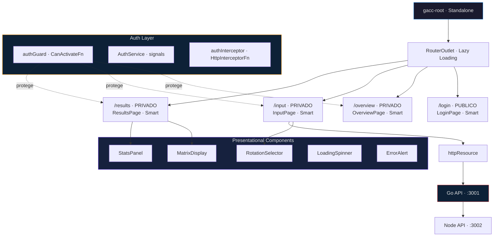
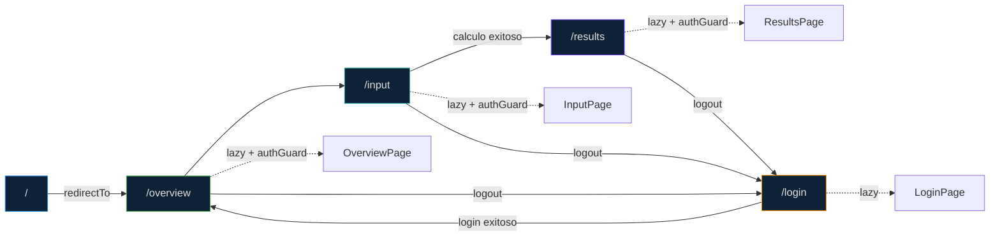
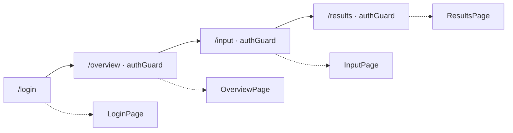

# Especificacion Frontend — Angular 21

**Framework**: Angular 21.2  
**UI**: Angular Material 3 + CDK  
**Estilos**: SCSS · Metodologia BEM  
**Arquitectura**: Container/Presentational  
**Diseno**: Gallery Aesthetic  
**Testing**: Vitest via Angular Builder  
**Package Manager**: npm

---

## 1. Vision General

SPA con 4 rutas que consume la Go API para visualizar rotacion de matrices, factorizacion QR y estadisticas. El diseno sigue la guia **Gallery Aesthetic**: photography-first, paleta monocromatica neutra, un solo acento Action Blue (#0066cc), tiles full-bleed alternando fondos claros y oscuros, y tipografia Inter con tracking negativo.

### Pantallas

| Ruta | Acceso | Pantalla | Componente |
|---|---|---|---|
| `/login` | Publico | Login · Autenticacion JWT | `LoginPage` |
| `/overview` | Privado · authGuard | Vista general con accesos rapidos | `OverviewPage` |
| `/input` | Privado · authGuard | Formulario de matriz + selector de rotacion | `InputPage` |
| `/results` | Privado · authGuard | Visualizacion de Q, R, rotated y estadisticas | `ResultsPage` |

### Diagrama de Arquitectura



### Flujo de Navegacion



---

## 2. Arquitectura: Container / Presentational

### Separacion de Responsabilidades

| Tipo | Responsabilidad | Componentes |
|---|---|---|
| **Smart (Container)** | Orquesta datos, servicios, estado, navegacion. Unicos que injectan dependencias. | `LoginPage`, `OverviewPage`, `InputPage`, `ResultsPage` |
| **Dumb (Presentational)** | Reciben datos via `input()`, emiten eventos via `output()`. Sin dependencias de negocio. Altamente reutilizables y testeables. | `MatrixDisplay`, `StatsPanel`, `RotationSelector`, `LoadingSpinner`, `ErrorAlert` |

### Estado Compartido

`FactorizationState` (servicio inyectable con signals) actua como puente entre `InputPage` y `ResultsPage`:

1. `InputPage` recibe la respuesta de la API y la almacena en `FactorizationState`
2. Navega a `/results`
3. `ResultsPage` lee `FactorizationState.response()` para renderizar
4. Si no hay datos, redirige a `/input`

---

## 3. Diseno: Gallery Aesthetic

### Paleta de Colores

| Token | Hex | Uso |
|---|---|---|
| `canvas` | `#ffffff` | Tiles claros principales |
| `canvas-parchment` | `#f5f5f7` | Alternancia de secciones |
| `surface-dark` | `#272729` | Tiles oscuros, seccion stats |
| `surface-black` | `#000000` | Global nav toolbar |
| `primary` | `#0066cc` | Unico acento: links, CTAs, focus ring |
| `primary-focus` | `#0071e3` | Outline de focus |
| `primary-on-dark` | `#2997ff` | Links sobre superficies oscuras |
| `ink` | `#1d1d1f` | Headlines, body text |
| `ink-muted` | `#7a7a7a` | Texto secundario, disabled |
| `on-dark` | `#ffffff` | Texto sobre superficies oscuras |
| `on-dark-muted` | `#cccccc` | Texto secundario sobre oscuro |
| `hairline` | `#e0e0e0` | Borde 1px en cards |

### Tipografia

| Token | Size | Weight | Line Height | Letter Spacing |
|---|---|---|---|---|
| Hero Display | 56px | 600 | 1.07 | -0.28px |
| Display LG | 40px | 600 | 1.10 | 0 |
| Display MD | 34px | 600 | 1.47 | -0.374px |
| Body | 17px | 400 | 1.47 | -0.374px |
| Caption | 14px | 400 | 1.43 | -0.01em |
| Nav Link | 12px | 400 | 1.0 | -0.12px |

**Font**: `Inter, system-ui, -apple-system, sans-serif`

### Principios del Diseno

- **Un solo acento**: Action Blue (#0066cc) para todo elemento interactivo
- **Sin gradientes decorativos**: atmosfera por fotografia y contraste, no CSS
- **Sin sombras en UI**: cards, botones y texto son flat. El cambio de color entre tiles es el divisor
- **Tiles full-bleed**: alternan `#ffffff` → `#f5f5f7` → `#272729`
- **Pill CTAs**: border-radius 9999px en todos los botones de accion
- **Global Nav**: barra negra 44px, links 12px
- **Sub-Nav**: frosted glass (blur 20px), 52px, fondo #f5f5f7 al 80%

---

## 4. Componentes de Angular Material

### Catalogo por Categoria

**Form Controls**: `MatFormField` (outline), `MatInput`, `MatLabel`, `MatError`, `MatSelect`, `MatOption`, `MatHint`, `MatPrefix`, `MatSuffix`

**Navigation**: `MatToolbar` (global nav + sub-nav)

**Buttons**: `MatButton` (flat, stroked), `MatIconButton`, `MatIcon`

**Indicators**: `MatProgressSpinner` (loading states)

**Layout**: `MatCard` (header, title, subtitle, content, actions), `MatDivider`

**Popups**: `MatSnackBar` (notificaciones), `MatTooltip`

### Uso por Pantalla

| Pantalla | Material Components |
|---|---|
| **Login** | `MatCard`, `MatFormField` (outline), `MatLabel`, `MatInput`, `MatIcon` (prefix), `MatError`, `MatButton` (flat) |
| **Overview** | `MatToolbar`, `MatIconButton`, `MatIcon`, `MatCard` |
| **Input** | `MatToolbar`, `MatFormField`, `MatSelect`, `MatOption`, `MatLabel`, `MatProgressSpinner`, `MatSnackBar` |
| **Results** | `MatToolbar`, `MatCard`, `MatIcon`, `MatButton` (stroked) |

---

## 5. Metodologia BEM

Todas las clases SCSS siguen la convencion **Block__Element--Modifier**:

```scss
.login { }                  // Block
.login__card { }            // Block__Element
.login--loading { }         // Block--Modifier
.login__submit { }          // Block__Element
```

### SCSS por Componente

Cada componente tiene su archivo `.scss` con anidacion BEM via `&__element` y `&--modifier`. Las variables globales (colores, tipografia, espaciado) se definen en `src/styles/_variables.scss` y se acceden via `@use 'variables' as *` con `stylePreprocessorOptions.includePaths` configurado en `angular.json`.

---

## 6. Estructura de Carpetas

```
apps/frontend/src/app/
├── core/
│   ├── auth/
│   │   ├── auth.service.ts        # signals: token, isAuthenticated
│   │   ├── auth.guard.ts          # CanActivateFn funcional
│   │   └── auth.interceptor.ts    # HttpInterceptorFn
│   ├── http/
│   │   └── api-url.token.ts       # InjectionToken<string>
│   ├── models/
│   │   ├── matrix.model.ts        # FactorizationResponse, StatsResponse
│   │   ├── auth.model.ts          # LoginRequest, AuthResponse
│   │   └── rotation.types.ts      # RotationType + ROTATION_OPTIONS
│   └── state/
│       └── factorization.state.ts # Signal compartido entre Input/Results
│
├── features/
│   ├── login/
│   │   └── login-page.component.ts    # Smart · PUBLICO
│   ├── overview/
│   │   └── overview-page.component.ts # Smart · PRIVADO
│   ├── input/
│   │   └── input-page.component.ts    # Smart · PRIVADO
│   └── results/
│       ├── results-page.component.ts  # Smart · PRIVADO
│       └── components/
│           ├── matrix-display/    # Dumb
│           └── stats-panel/       # Dumb
│
└── shared/
    └── components/
        ├── rotation-selector/     # Dumb
        ├── loading-spinner/       # Dumb
        └── error-alert/           # Dumb
```

---

## 7. Rutas y Seguridad

### Definicion



### AuthGuard

Functional guard (`CanActivateFn`) que verifica `AuthService.isAuthenticated()`. Si no hay token, redirige a `/login` via `router.createUrlTree(['/login'])`.

### AuthInterceptor

`HttpInterceptorFn` que agrega `Authorization: Bearer <token>` a todas las peticiones cuyo destino coincida con `API_URL`.

### Lazy Loading

Las 4 rutas cargan sus componentes bajo demanda con `loadComponent()`, reduciendo el bundle inicial.

---

## 8. Tipos de Rotacion

| Valor | Descripcion |
|---|---|
| `none` | Sin rotacion |
| `clockwise_90` | 90° horario |
| `clockwise_180` | 180° |
| `clockwise_270` | 270° horario (90° antihorario) |
| `transpose` | Transposicion |
| `horizontal_flip` | Espejo horizontal |
| `vertical_flip` | Espejo vertical |

El `RotationSelectorComponent` renderiza las 7 opciones en un `<mat-select>` con el tipo `RotationType`.

---

## 9. Dependencias

### Produccion

| Libreria | Version | Proposito |
|---|---|---|
| `@angular/core` | ^21.2.0 | Signals, inject(), standalone, httpResource |
| `@angular/router` | ^21.2.0 | Lazy loading, functional guards |
| `@angular/material` | ^21.2.10 | Material 3 components |
| `@angular/cdk` | ^21.2.10 | BreakpointObserver, a11y |
| `@angular/forms` | ^21.2.0 | Reactive forms |

### Desarrollo

| Libreria | Version | Proposito |
|---|---|---|
| `typescript` | ~5.9.2 | Type checker |
| `@angular/cli` | ^21.2.10 | Serve, build, generate |
| `@angular/build` | ^21.2.10 | esbuild application builder |
| `vitest` | ^4.0.8 | Test runner |
| `@vitest/coverage-v8` | ^4.1.5 | Coverage |
| `jsdom` | ^28.0.0 | DOM environment |

---

## 10. Mejores Practicas Angular 21

- `standalone: true` en todos los componentes
- `ChangeDetectionStrategy.OnPush` en todos los componentes
- `inject()` en lugar de constructor DI
- `input.required()` para props obligatorias
- `output()` tipado estricto
- `computed()` para valores derivados
- `@if` / `@for` / `@switch` (nuevo control flow)
- `loadComponent()` para lazy loading
- Functional guards (`CanActivateFn`)
- `httpResource` para API calls (cancelacion automatica)
- `withInterceptors()` para JWT en HttpClient
- `InjectionToken` para valores de configuracion
- BEM en SCSS con `styleUrl`
- `host` property en `@Component` para bindings del elemento raiz
- `transform` en `input()` para coercion de tipos

---

## 11. Responsive Breakpoints

| Nombre | Width | Cambios |
|---|---|---|
| Phone | ≤ 640px | Single column, tiles padding 48px |
| Tablet | ≤ 834px | Nav links ocultos |
| Desktop | ≤ 1068px | Grid 3-col a 2-col |
| Wide | ≤ 1440px | Content lock |

---

## 12. Docker

Imagen multi-stage con NGINX para servir el build de produccion. El `nginx.conf` incluye reglas SPA (`try_files $uri /index.html`) y compresion gzip.

---

*Documento version 5.1 — Mayo 2026*
