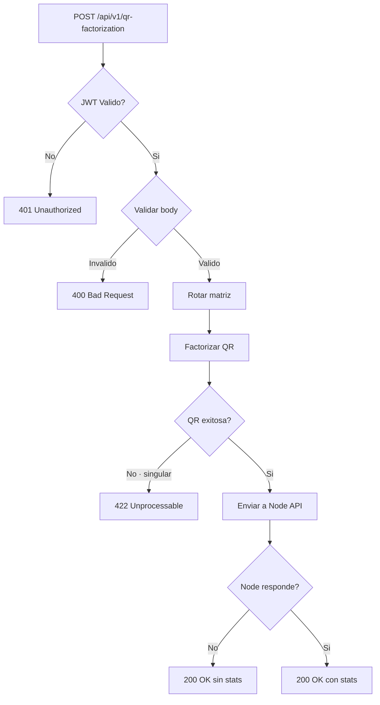

# Go API — Rotacion y Factorizacion QR

**Servicio**: go-api  
**Framework**: Fiber v3  
**Puerto**: 3001  
**Lenguaje**: Go 1.25

---

## Diagrama de Flujo



---

## Endpoints

### Health Check
- `GET /health`
- Respuesta: `{ status, service, timestamp }`

### Autenticacion
- `POST /api/v1/auth/login`
- Body: `{ username, password }`
- Respuesta: `{ token, type: "Bearer", expiresIn: 3600 }`
- Error 401: `{ error, code: "AUTH_INVALID_CREDENTIALS" }`

### Factorizacion QR (protegido)
- `POST /api/v1/qr-factorization`
- Header: `Authorization: Bearer <jwt>`
- Body: `{ matrix: number[][], rotation: string }`
- Respuesta: `{ original, rotated, rotation, Q, R, stats }`

### Swagger
- `GET /swagger` → Redirige a `/swagger/index.html`
- `GET /swagger/doc.json` → Especificacion OpenAPI 2.0

---

## Codigos de Error

| HTTP | Codigo | Causa |
|---|---|---|
| 400 | `VALIDATION_ERROR` | Matriz vacia, rotacion invalida, JSON malformado |
| 401 | `AUTH_MISSING_TOKEN` | Header Authorization ausente |
| 401 | `AUTH_INVALID_FORMAT` | Header no es "Bearer <token>" |
| 401 | `AUTH_INVALID_TOKEN` | Token invalido o expirado |
| 401 | `AUTH_INVALID_CREDENTIALS` | Usuario o contrasena incorrectos |
| 422 | `QR_FACTORIZATION_ERROR` | Matriz singular o rango-deficiente |
| 500 | `INTERNAL_ERROR` | Error interno del servidor |

---

## Algoritmo de Rotacion

Siete transformaciones implementadas en `pkg/matrix/matrix.go`:

| Rotacion | Descripcion |
|---|---|
| `none` | Sin modificar |
| `clockwise_90` | 90° horario: `result[i][j] = matrix[rows-1-j][i]` |
| `clockwise_180` | 180°: `result[i][j] = matrix[rows-1-i][cols-1-j]` |
| `clockwise_270` | 270°: `result[i][j] = matrix[j][cols-1-i]` |
| `transpose` | Transposicion: `result[i][j] = matrix[j][i]` |
| `horizontal_flip` | Espejo horizontal: `result[i][j] = matrix[i][cols-1-j]` |
| `vertical_flip` | Espejo vertical: `result[i] = matrix[rows-1-i]` |

---

## Algoritmo QR: Gram-Schmidt Modificado

Para una matriz A (m×n, m ≥ n), el algoritmo produce Q (m×n ortonormal) y R (n×n triangular superior) tal que A = QR.

### Pseudocodigo

1. Extraer columnas de A como vectores V[0..n-1]
2. Para cada columna j:
   - Para i < j: `R[i][j] = V[j] · Q[:,i]`; `V[j] -= R[i][j] * Q[:,i]`
   - `R[j][j] = ||V[j]||` (norma euclidiana)
   - Si `R[j][j] < 1e-12`: error (matriz singular)
   - `Q[:,j] = V[j] / R[j][j]`

### Funciones Auxiliares
- `dotProduct(v1, v2)` — Producto punto de vectores
- `euclideanNorm(v)` — Norma euclidiana (sqrt de suma de cuadrados)
- `col(matrix, j)` — Extrae columna j como vector

---

## Comunicacion con Node API

La Go API actua como cliente HTTP de la Node API usando la libreria `resty/v2`:

1. Genera un JWT interno (`sub: "go-api-internal"`)
2. Envia `POST /api/v1/stats` con body `{ matrices: [Q, R, rotated] }`
3. Configuracion: timeout 10s, 2 reintentos con backoff 500ms para errores 5xx
4. Si la Node API no responde, se aplica graceful degradation (stats = null)

---

## Estructura de Carpetas

```
apps/go-api/
├── cmd/api/
│   ├── main.go              # Punto de entrada · Fiber app + CORS + rutas
│   └── docs/                # Swagger embebido via go:embed
├── internal/
│   ├── config/              # EnvConfig · variables de entorno
│   ├── handlers/            # AuthHandler, QRHandler, HealthHandler
│   ├── middleware/           # JWTAuth, ValidateFactorizeRequest, Logger, Recover
│   ├── models/              # DTOs · Request/Response
│   └── services/            # QRService (orquestacion), NodeClient (HTTP)
├── pkg/
│   └── matrix/              # Rotate(), FactorizeQR(), IsValidRotation()
└── tests/
    ├── handlers/
    └── middleware/
```

---

## Dependencias

| Libreria | Version | Proposito |
|---|---|---|
| `github.com/gofiber/fiber/v3` | v3 | Framework HTTP |
| `github.com/gofiber/fiber/v3/middleware/cors` | v3 | CORS middleware |
| `github.com/golang-jwt/jwt/v5` | v5 | JWT HS256 |
| `github.com/go-resty/resty/v2` | v2 | HTTP client para Node API |
| `github.com/joho/godotenv` | v1.5.1 | Carga de .env |

---

## Cobertura de Tests

| Paquete | Funciones clave | Cobertura |
|---|---|---|
| `pkg/matrix` | Rotate, FactorizeQR, helpers | 96-100% |
| `internal/config` | Load, getEnv | 100% |
| `internal/handlers` | Login, Factorize, Check | 84-100% |
| `internal/middleware` | JWTAuth, Validate, Logger, Recover | 87-100% |
| `internal/services` | ProcessMatrix, SendMatrices | 70-100% |
| **Total** (excl. main) | — | **93.4%** |

---

## Variables de Entorno

| Variable | Default | Descripcion |
|---|---|---|
| `PORT` | `3001` | Puerto HTTP |
| `JWT_SECRET` | `default-secret-change-in-production` | Clave JWT |
| `JWT_EXPIRATION` | `3600` | Duracion del token (segundos) |
| `AUTH_USERNAME` | `admin` | Usuario |
| `AUTH_PASSWORD` | `secret` | Contrasena |
| `NODE_API_URL` | `http://localhost:3002` | URL de Node API |

---

*Documento version 3.0 — Mayo 2026*
