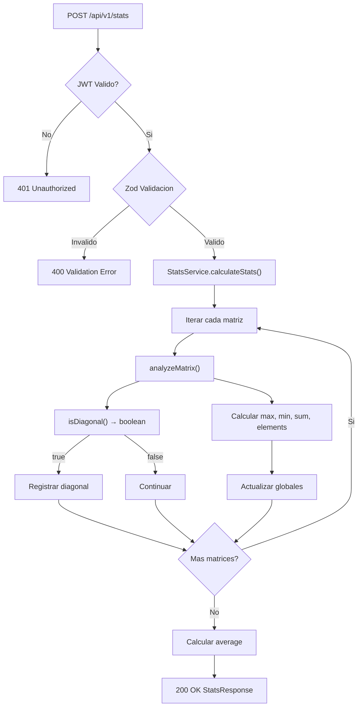

# Node API — Estadisticas de Matrices

**Servicio**: node-api  
**Framework**: Express 5.2 + TypeScript 5.9  
**Puerto**: 3002  
**Runtime**: Node.js 20  
**Testing**: Vitest  
**Validacion**: Zod 4

---

## Diagrama de Flujo



---

## Endpoints

### Health Check
- `GET /health`
- Respuesta: `{ status, service, timestamp, environment }`

### Autenticacion
- `POST /api/v1/auth/login`
- Body: `{ username: string, password: string }`
- Respuesta: `{ token, type: "Bearer", expiresIn: 3600 }`

### Estadisticas (protegido)
- `POST /api/v1/stats`
- Header: `Authorization: Bearer <jwt>`
- Body: `{ matrices: number[][][] }`
- Respuesta: `StatsResponse`

### Swagger
- `GET /api-docs` → Swagger UI
- `GET /api-docs.json` → Especificacion OpenAPI 3.0

---

## Codigos de Error

| HTTP | Codigo | Causa |
|---|---|---|
| 400 | `VALIDATION_ERROR` | Matriz vacia, filas inconsistentes, elemento no numerico |
| 401 | `AUTH_MISSING_TOKEN` | Header Authorization ausente |
| 401 | `AUTH_INVALID_FORMAT` | Header no es "Bearer <token>" |
| 401 | `AUTH_INVALID_TOKEN` | Token invalido o expirado |
| 401 | `AUTH_INVALID_CREDENTIALS` | Usuario o contrasena incorrectos |
| 500 | `STATS_CALCULATION_ERROR` | Error al calcular estadisticas |
| 500 | `INTERNAL_ERROR` | Error interno del servidor |

---

## Algoritmo de Estadisticas

El servicio itera sobre cada matriz del array recibido y calcula:

### Por matriz (analyzeMatrix)
- **max**: valor maximo de la matriz
- **min**: valor minimo de la matriz
- **sum**: suma de todos los elementos
- **elements**: cantidad de elementos
- **isDiagonal**: true si es cuadrada y |M[i][j]| ≤ 1×10⁻¹⁰ para i ≠ j

### Globales
- **globalMax** = max(max de cada matriz)
- **globalMin** = min(min de cada matriz)
- **globalSum** = suma de todas las sumas parciales
- **totalElements** = suma de elementos de todas las matrices
- **average** = globalSum / totalElements
- **numberOfMatrices** = cantidad de matrices procesadas

### Deteccion de Matrices Diagonales

Una matriz es diagonal si:
1. Es cuadrada (n × n)
2. Para todo i ≠ j, |M[i][j]| ≤ 1×10⁻¹⁰ (tolerancia para errores de punto flotante)

Las matrices diagonales se reportan con su nombre contextual:
- Indice 0: "Q (Orthogonal)"
- Indice 1: "R (Upper Triangular)"
- Indice 2: "Rotated Matrix"
- Indice ≥ 3: "Matrix <n>"

---

## Estructura de Carpetas

```
apps/node-api/
├── src/
│   ├── index.ts              # Punto de entrada
│   ├── app.ts                # Clase App · configuracion Express
│   ├── swagger.ts            # Especificacion OpenAPI hardcoded
│   ├── config/
│   │   └── env.ts            # EnvConfig · clase con defaults
│   ├── controllers/
│   │   ├── auth.controller.ts
│   │   ├── health.controller.ts
│   │   └── stats.controller.ts
│   ├── middleware/
│   │   ├── jwt.middleware.ts       # Factory: createJwtMiddleware(secret)
│   │   ├── error.middleware.ts     # Error handler centralizado
│   │   └── validation.middleware.ts # Factory: validateSchema(schema)
│   ├── routes/
│   │   ├── auth.routes.ts
│   │   └── stats.routes.ts
│   ├── services/
│   │   ├── auth.service.ts   # Clase AuthService
│   │   └── stats.service.ts  # Clase StatsService
│   ├── schemas/
│   │   ├── auth.schema.ts    # Zod: LoginRequestSchema
│   │   └── stats.schema.ts   # Zod: StatsRequestSchema, MatrixSchema
│   └── types/
│       ├── matrix.types.ts
│       ├── auth.types.ts
│       └── error.types.ts
└── tests/
    └── unit/
        ├── config/
        ├── controllers/
        ├── middleware/
        ├── schemas/
        └── services/
```

---

## Patrones de Arquitectura

### Inyeccion de Dependencias via Clases

Toda la logica de negocio se organiza en clases con inyeccion por constructor. Esto permite:

- **Testabilidad**: cada dependencia se mockea facilmente
- **Bajo acoplamiento**: servicios, controllers y routes son independientes
- **Consistencia**: mismo patron en todo el proyecto

### Middleware Factory Pattern

Los middlewares se implementan como factory functions que reciben configuracion y retornan un `RequestHandler`:

- `createJwtMiddleware(secret)` → middleware JWT configurable
- `validateSchema(schema)` → middleware Zod configurable

### Swagger Hardcoded

La especificacion OpenAPI 3.0 esta definida como un objeto estatico en `swagger.ts` en lugar de usar `swagger-jsdoc`. Esto elimina la dependencia de archivos fuente en runtime (importante para la imagen Docker de produccion).

---

## Dependencias

### Produccion

| Libreria | Version | Proposito |
|---|---|---|
| `express` | ^5.2.1 | Framework HTTP |
| `cors` | ^2.8.6 | Cross-Origin Resource Sharing |
| `jsonwebtoken` | ^9.0.3 | JWT HS256 |
| `dotenv` | ^17.4.2 | Variables de entorno |
| `zod` | ^4.4.3 | Validacion declarativa con inferencia TS |

### Desarrollo

| Libreria | Version | Proposito |
|---|---|---|
| `typescript` | ^6.0.3 | Compilador TS |
| `vitest` | ^4.1.5 | Testing |
| `supertest` | ^7.2.2 | HTTP testing |
| `@types/*` | — | Tipos para librerias JS |

---

## Cobertura de Tests

| Metrica | Porcentaje |
|---|---|
| Statements | 100% |
| Branches | 95.7% |
| Functions | 100% |
| Lines | 100% |

70 tests en 9 archivos de test.

---

## Variables de Entorno

| Variable | Default | Descripcion |
|---|---|---|
| `PORT` | `3002` | Puerto HTTP |
| `JWT_SECRET` | `default-secret-change-in-production` | Clave JWT |
| `JWT_EXPIRATION` | `3600` | Duracion del token (segundos) |
| `AUTH_USERNAME` | `admin` | Usuario |
| `AUTH_PASSWORD` | `secret` | Contrasena |
| `NODE_ENV` | `development` | Entorno |
| `CORS_ORIGIN` | `*` | Origen permitido |

---

*Documento version 3.1 — Mayo 2026*
