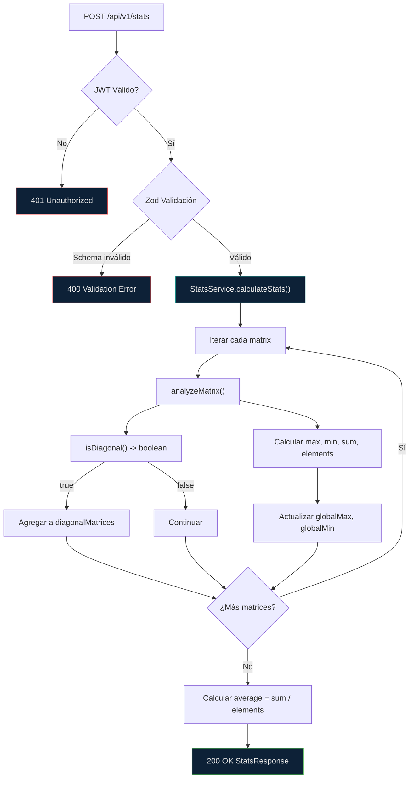

# Especificación API Node.js - Estadísticas de Matrices

**Servicio**: node-api  
**Framework**: Express.js + TypeScript  
**Puerto**: 3002  
**Runtime**: Node.js 20+ (ESM strict mode)  
**Testing**: Vitest  
**Validación**: Zod  
**Arquitectura**: Clases

---

## Diagrama de Flujo del Servicio



---

## 1. Tabla de Dependencias (Production)

| Librería | Versión | ¿Por qué se agrega? |
|----------|---------|---------------------|
| `express` | ^5.2.1 | Framework HTTP estándar. Express 5: mejor manejo async, path-to-regexp actualizado, `req.query` getter |
| `jsonwebtoken` | ^9.0.3 | Crear y validar JWT |
| `cors` | ^2.8.6 | Cross-origin requests |
| `dotenv` | ^17.4.2 | Variables de entorno `.env` |
| `zod` | ^4.4.3 | Validación declarativa con inferencia TS. Pipeline API, `.pipe()`, mejor rendimiento |
| `swagger-jsdoc` | ^6.2.8 | Genera especificación OpenAPI 3.0 desde anotaciones JSDoc en el código | `tsoa` (requiere decorators), `nestjs/swagger` (requiere NestJS) |
| `swagger-ui-express` | ^5.0.1 | Sirve Swagger UI como middleware Express. Interfaz interactiva para probar endpoints | `redoc-express` (solo lectura, sin "Try it out") |

### Breaking Changes Express 5

| Cambio | Descripción |
|--------|-------------|
| `app.del()` | Eliminado, usar `app.delete()` |
| `req.query` | Ahora es getter, no mutable |
| `res.json()` | Acepta solo objetos serializables |
| `req.path` | Path matching más estricto |
| `async errors` | Manejo automático de errores async |
| `res.send(status, body)` | Deprecado, usar `res.status(status).send(body)` |

### Breaking Changes Zod 4

| Cambio | Descripción |
|--------|-------------|
| `.pipe()` | Nueva API para composición de schemas |
| `z.object()` | Comportamiento refinado con `strict`/`passthrough` |
| `z.coerce` | Nuevo namespace, reemplaza `z.preprocess` |
| `z.custom()` | Removido, usar `z.any().superRefine()` |
| `discriminatedUnion` | Nueva firma `z.discriminatedUnion(discriminator, schemas)` |

---

## 2. Documentación Swagger (swagger-jsdoc + swagger-ui-express)

### Configuración

```typescript
// src/swagger.ts
import swaggerJsdoc from 'swagger-jsdoc';
import swaggerUi from 'swagger-ui-express';

const options: swaggerJsdoc.Options = {
  definition: {
    openapi: '3.0.0',
    info: {
      title: 'Coding Challenge API (Node.js)',
      version: '1.0.0',
      description: 'API para cálculo de estadísticas sobre matrices (Q, R, rotated)',
      contact: {
        name: 'División TI - Interseguro',
        email: 'ti@interseguro.pe'
      }
    },
    servers: [{ url: 'http://localhost:3002', description: 'Local' }],
    components: {
      securitySchemes: {
        BearerAuth: {
          type: 'http',
          scheme: 'bearer',
          bearerFormat: 'JWT'
        }
      }
    },
    security: [{ BearerAuth: [] }]
  },
  apis: ['./src/controllers/*.ts', './src/types/*.ts']
};

export const swaggerSpec = swaggerJsdoc(options);
export { swaggerUi };
```

### Uso en Clase App

```typescript
// src/app.ts
import { swaggerSpec, swaggerUi } from './swagger';

export class App {
  private setupSwagger(): void {
    // Swagger UI
    this.app.use('/api-docs', swaggerUi.serve, swaggerUi.setup(swaggerSpec));
    
    // OpenAPI JSON
    this.app.get('/api-docs.json', (req, res) => {
      res.setHeader('Content-Type', 'application/json');
      res.send(swaggerSpec);
    });
  }
}
```

### Anotaciones JSDoc en Controllers

```typescript
// src/controllers/stats.controller.ts

/**
 * @swagger
 * /api/v1/stats:
 *   post:
 *     summary: Calcular estadísticas de matrices
 *     description: Recibe matrices Q, R y rotated, calcula máximo, mínimo, promedio, suma y verifica matrices diagonales
 *     tags: [Stats]
 *     security:
 *       - BearerAuth: []
 *     requestBody:
 *       required: true
 *       content:
 *         application/json:
 *           schema:
 *             type: object
 *             required:
 *               - matrices
 *             properties:
 *               matrices:
 *                 type: array
 *                 items:
 *                   type: array
 *                   items:
 *                     type: array
 *                     items:
 *                       type: number
 *                 example:
 *                   - [[1, 2], [3, 4]]
 *                   - [[0.169, 0.897], [0.507, 0.276]]
 *     responses:
 *       200:
 *         description: Estadísticas calculadas
 *         content:
 *           application/json:
 *             schema:
 *               $ref: '#/components/schemas/StatsResponse'
 *       400:
 *         description: Error de validación
 *       401:
 *         description: No autorizado
 *       500:
 *         description: Error interno
 */
public async calculate(req: Request, res: Response): Promise<void> {
  // ...
}

/**
 * @swagger
 * /api/v1/auth/login:
 *   post:
 *     summary: Autenticar usuario
 *     tags: [Auth]
 *     requestBody:
 *       required: true
 *       content:
 *         application/json:
 *           schema:
 *             type: object
 *             required: [username, password]
 *             properties:
 *               username:
 *                 type: string
 *               password:
 *                 type: string
 *                 minLength: 6
 *     responses:
 *       200:
 *         description: Token JWT
 *       401:
 *         description: Credenciales inválidas
 */
public async login(req: Request, res: Response): Promise<void> {
  // ...
}
```

### Schemas en Tipos

```typescript
// src/types/swagger.types.ts

/**
 * @swagger
 * components:
 *   schemas:
 *     StatsResponse:
 *       type: object
 *       properties:
 *         max:
 *           type: number
 *           example: 7.4374
 *         min:
 *           type: number
 *           example: -0.3451
 *         average:
 *           type: number
 *           example: 2.0891
 *         sum:
 *           type: number
 *           example: 25.0692
 *         totalElements:
 *           type: integer
 *           example: 12
 *         numberOfMatrices:
 *           type: integer
 *           example: 3
 *         diagonalMatrices:
 *           type: object
 *           properties:
 *             count:
 *               type: integer
 *             matrices:
 *               type: array
 *               items:
 *                 type: object
 *                 properties:
 *                   matrixIndex:
 *                     type: integer
 *                   name:
 *                     type: string
 *                   dimensions:
 *                     type: string
 *     ErrorResponse:
 *       type: object
 *       properties:
 *         error:
 *           type: string
 *         code:
 *           type: string
 *         status:
 *           type: integer
 *         details:
 *           type: object
 */
export interface StatsResponse { /* ... */ }
export interface ErrorResponse { /* ... */ }
```

### Acceso

| URL | Descripción |
|-----|-------------|
| `http://localhost:3002/api-docs` | Swagger UI interactivo |
| `http://localhost:3002/api-docs.json` | OpenAPI 3.0 JSON spec |

### Comparativa Go vs Node.js Swagger

| Aspecto | Go API (swaggo) | Node.js API (swagger-jsdoc) |
|---------|----------------|---------------------------|
| Especificación | OpenAPI 2.0 (Swagger) | OpenAPI 3.0 |
| Anotaciones | Comentarios Go `// @` | JSDoc `@swagger` |
| Generación | Build-time (`swag init`) | Runtime (al iniciar app) |
| UI | `/swagger/*` | `/api-docs` |
| CLI requerido | Sí (`swag init`) | No |
| Versión | v1.16+ | v6.2.8 |

### Por qué Zod

```typescript
// Schema define validación + tipo TypeScript en uno
const StatsRequestSchema = z.object({
  matrices: z.array(z.array(z.array(z.number()))).min(1)
});

// Tipo inferido automáticamente
type StatsRequest = z.infer<typeof StatsRequestSchema>;
```

| Aspecto | Zod | Sin validación | Joi | class-validator |
|---------|-----|---------------|-----|----------------|
| Tipado TS | Inferido automático | Manual | Manual | Decoradores |
| Bundle size | 13KB | 0 | 150KB | 100KB |
| Composición | Schemas combinables | N/A | Medio | Decoradores |
| Errores | Path exacto + mensaje | N/A | Mensajes | Mensajes |

---

## 3. Tabla de DevDependencies (Desarrollo)

| Librería | Versión | ¿Por qué se agrega? |
|----------|---------|---------------------|
| `typescript` | ^6.0.3 | Última versión con mejor inferencia de tipos |
| `tsx` | ^4.21.0 | Ejecutar TS en desarrollo (más rápido que ts-node, compatible Bun) |
| `@types/node` | ^22.13.0 | Tipos Node.js |
| `@types/express` | ^5.0.6 | Tipos Express 5 |
| `@types/express-serve-static-core` | ^5.1.1 | Tipos core para Express 5 |
| `@types/jsonwebtoken` | ^9.0.10 | Tipos JWT |
| `@types/cors` | ^2.8.19 | Tipos CORS |
| `vitest` | ^4.1.5 | Testing moderno, ESM nativo |
| `supertest` | ^7.2.2 | Testing HTTP endpoints |
| `@types/supertest` | ^7.2.0 | Tipos Supertest |
| `@types/swagger-ui-express` | ^4.1.8 | Tipos Swagger UI Express |
| `@types/swagger-jsdoc` | ^6.0.4 | Tipos Swagger JSDoc |

### Por qué Vitest en lugar de Jest

| Aspecto | Vitest | Jest |
|---------|--------|------|
| Velocidad | Más rápido (HMR) | Más lento |
| ESM | Nativo | Requiere configuración |
| Config | Mínima (`vitest.config.ts`) | `jest.config.js` |
| TypeScript | Nativo con tsx | Requiere ts-jest |
| Compatibilidad | API Jest (describe, it, expect) | N/A |
| Watch mode | Instantáneo | Lento |

---

## 4. Estructura de Carpetas (Arquitectura de Clases)

```
apps/node-api/
│
├── src/
│   ├── index.ts                    # Bootstrap: instancia y ejecuta App
│   ├── app.ts                      # Clase App: configura Express
│   │
│   ├── config/
│   │   └── env.ts                  # Clase EnvConfig
│   │
│   ├── controllers/
│   │   ├── auth.controller.ts      # Clase AuthController
│   │   ├── stats.controller.ts     # Clase StatsController
│   │   └── health.controller.ts    # Clase HealthController
│   │
│   ├── middleware/
│   │   ├── jwt.middleware.ts       # Función factory de middleware JWT
│   │   ├── error.middleware.ts     # Función factory de error handler
│   │   └── validation.middleware.ts # Función factory con schemas Zod
│   │
│   ├── routes/
│   │   ├── auth.routes.ts          # Clase AuthRoutes
│   │   ├── stats.routes.ts         # Clase StatsRoutes
│   │   └── index.ts                # Clase AppRoutes (agregador)
│   │
│   ├── services/
│   │   ├── stats.service.ts        # Clase StatsService
│   │   └── auth.service.ts         # Clase AuthService
│   │
│   ├── schemas/
│   │   ├── stats.schema.ts         # Zod schemas para stats
│   │   └── auth.schema.ts          # Zod schemas para auth
│   │
│   ├── types/
│   │   ├── matrix.types.ts         # Interfaces TypeScript
│   │   ├── auth.types.ts           # Interfaces auth
│   │   └── express.d.ts            # Extensiones tipos Express
│   │
│   └── models/
│       └── index.ts                # DTOs centralizados
│
├── tests/
│   ├── unit/
│   │   ├── services/
│   │   │   └── stats.service.test.ts
│   │   ├── controllers/
│   │   │   └── stats.controller.test.ts
│   │   ├── middleware/
│   │   │   └── jwt.middleware.test.ts
│   │   └── schemas/
│   │       └── stats.schema.test.ts
│   │
│   └── setup.ts                    # Config test (mocks, env)
│
├── vitest.config.ts                # Config Vitest
├── package.json
├── tsconfig.json
├── .env.example
├── Dockerfile
└── .dockerignore
```

### Arquitectura de Clases

Toda la lógica de negocio se organiza en clases con inyección de dependencias por constructor:

```typescript
// Ejemplo: StatsController
export class StatsController {
  constructor(private readonly statsService: StatsService) {}
  
  async calculate(req: Request, res: Response): Promise<void> {
    const validated = StatsRequestSchema.parse(req.body);
    const result = this.statsService.calculateStats(validated.matrices);
    res.json(result);
  }
}

// Ejemplo: StatsRoutes
export class StatsRoutes {
  public readonly router: Router;
  
  constructor(private readonly statsController: StatsController) {
    this.router = Router();
    this.router.post(
      '/api/v1/stats',
      jwtMiddleware,
      validateSchema(StatsRequestSchema),
      this.statsController.calculate.bind(this.statsController)
    );
  }
}
```

---

## 5. Clase App (Inicialización)

```typescript
import express from 'express';
import cors from 'cors';
import { EnvConfig } from './config/env';
import { StatsService } from './services/stats.service';
import { AuthService } from './services/auth.service';
import { StatsController } from './controllers/stats.controller';
import { AuthController } from './controllers/auth.controller';
import { HealthController } from './controllers/health.controller';
import { StatsRoutes } from './routes/stats.routes';
import { AuthRoutes } from './routes/auth.routes';
import { errorMiddleware } from './middleware/error.middleware';

export class App {
  private readonly app: express.Application;
  
  constructor(private readonly config: EnvConfig) {
    this.app = express();
    this.setupMiddleware();
    this.setupRoutes();
    this.setupErrorHandling();
  }
  
  private setupMiddleware(): void {
    this.app.use(cors());
    this.app.use(express.json());
  }
  
  private setupRoutes(): void {
    const statsService = new StatsService();
    const authService = new AuthService(this.config);
    
    const statsController = new StatsController(statsService);
    const authController = new AuthController(authService);
    const healthController = new HealthController();
    
    this.app.use(new StatsRoutes(statsController).router);
    this.app.use(new AuthRoutes(authController).router);
    this.app.get('/health', healthController.check.bind(healthController));
  }
  
  private setupErrorHandling(): void {
    this.app.use(errorMiddleware);
  }
  
  listen(): void {
    this.app.listen(this.config.PORT, () => {
      console.log(`Node API running on port ${this.config.PORT}`);
    });
  }
}
```

---

## 6. Schemas Zod

### 5.1 Stats Schema

```typescript
import { z } from 'zod';

// Schema para validar una matriz individual
export const MatrixSchema = z.array(
  z.array(
    z.number({
      required_error: "Matrix element is required",
      invalid_type_error: "Matrix element must be a number"
    })
  ).min(1, "Matrix row cannot be empty")
).min(1, "Matrix cannot be empty");

// Schema para el body completo
export const StatsRequestSchema = z.object({
  matrices: z.array(MatrixSchema).min(1, "At least one matrix is required")
});

// Schema con refinements para validaciones adicionales
export const StatsRequestRefinedSchema = z.object({
  matrices: z.array(MatrixSchema).min(1, "At least one matrix is required")
}).refine(
  (data) => data.matrices.every(m => MatrixUtils.rowsConsistent(m)),
  { message: "All rows in each matrix must have the same length" }
);

// Tipos inferidos automáticamente
export type StatsRequest = z.infer<typeof StatsRequestSchema>;
```

### 5.2 Auth Schema

```typescript
export const LoginRequestSchema = z.object({
  username: z.string().min(1, "Username is required"),
  password: z.string().min(6, "Password must be at least 6 characters")
});

export type LoginRequest = z.infer<typeof LoginRequestSchema>;
```

---

## 7. Endpoints

| Método | Ruta | Descripción | Auth |
|--------|------|-------------|------|
| GET | `/health` | Health check | No |
| POST | `/api/v1/auth/login` | Login, JWT | No |
| POST | `/api/v1/stats` | Estadísticas de matrices | Sí (JWT) |

### 6.1 POST `/api/v1/stats`

**Request**:
```json
{
  "matrices": [
    [[0.169, 0.897], [0.507, 0.276], [0.845, -0.345]],
    [[5.916, 7.437], [0.0, 0.828]],
    [[5, 3, 1], [6, 4, 2]]
  ]
}
```

**Response 200**:
```json
{
  "max": 7.437,
  "min": -0.345,
  "average": 2.089,
  "sum": 25.069,
  "totalElements": 12,
  "numberOfMatrices": 3,
  "diagonalMatrices": {
    "count": 1,
    "matrices": [{ "matrixIndex": 1, "name": "R (Upper Triangular)", "dimensions": "2x2" }]
  }
}
```

---

## 8. Validaciones y Errores

### Errores de Zod (400)

| Código | Ejemplo de mensaje |
|--------|-------------------|
| `VALIDATION_ERROR` | "Matrix at index 0: element [1][2] must be a number" |
| `VALIDATION_ERROR` | "Matrix at index 0: row cannot be empty" |
| `VALIDATION_ERROR` | "At least one matrix is required" |
| `VALIDATION_ERROR` | "All rows in each matrix must have the same length" |

### Errores de Auth (401)

| Código | Mensaje |
|--------|---------|
| `AUTH_MISSING_TOKEN` | "Authorization header is required" |
| `AUTH_INVALID_FORMAT` | "Authorization header must be 'Bearer <token>'" |
| `AUTH_INVALID_TOKEN` | "Invalid or expired token" |

### Errores del Servidor (500)

| Código | Mensaje |
|--------|---------|
| `INTERNAL_ERROR` | "Internal server error" |
| `STATS_CALCULATION_ERROR` | "Failed to calculate statistics" |

---

## 9. Servicio StatsService (Clase)

```typescript
export class StatsService {
  calculateStats(matrices: number[][][]): StatsResponse {
    let globalMax = -Infinity;
    let globalMin = Infinity;
    let globalSum = 0;
    let totalElements = 0;
    const diagonalMatrices: DiagonalMatrixInfo[] = [];

    matrices.forEach((matrix, index) => {
      const { max, min, sum, elements, isDiagonal } = this.analyzeMatrix(matrix);
      
      globalMax = Math.max(globalMax, max);
      globalMin = Math.min(globalMin, min);
      globalSum += sum;
      totalElements += elements;

      if (isDiagonal) {
        diagonalMatrices.push({
          matrixIndex: index,
          name: this.getMatrixName(index),
          dimensions: `${matrix.length}x${matrix[0].length}`
        });
      }
    });

    return {
      max: globalMax,
      min: globalMin,
      average: totalElements > 0 ? globalSum / totalElements : 0,
      sum: globalSum,
      totalElements,
      numberOfMatrices: matrices.length,
      diagonalMatrices: { count: diagonalMatrices.length, matrices: diagonalMatrices }
    };
  }

  private analyzeMatrix(matrix: number[][]): MatrixStats {
    let max = -Infinity;
    let min = Infinity;
    let sum = 0;
    let elements = 0;

    for (const row of matrix) {
      for (const value of row) {
        max = Math.max(max, value);
        min = Math.min(min, value);
        sum += value;
        elements++;
      }
    }

    return { max, min, sum, elements, isDiagonal: this.isDiagonal(matrix) };
  }

  private isDiagonal(matrix: number[][], tolerance = 1e-10): boolean {
    const n = matrix.length;
    if (!matrix.every((row, i) => row.length === n)) return false;

    for (let i = 0; i < n; i++) {
      for (let j = 0; j < n; j++) {
        if (i !== j && Math.abs(matrix[i][j]) > tolerance) return false;
      }
    }
    return true;
  }

  private getMatrixName(index: number): string {
    const names = ['Q (Orthogonal)', 'R (Upper Triangular)', 'Rotated Matrix'];
    return names[index] ?? `Matrix ${index}`;
  }
}
```

---

## 10. Middlewares (Factory Functions)

### JWT Middleware

```typescript
export function createJWTMiddleware(secret: string): RequestHandler {
  return (req, res, next) => {
    const authHeader = req.headers.authorization;
    
    if (!authHeader) {
      return res.status(401).json({ error: 'Authorization header is required', code: 'AUTH_MISSING_TOKEN' });
    }
    
    if (!authHeader.startsWith('Bearer ')) {
      return res.status(401).json({ error: 'Authorization header must be "Bearer <token>"', code: 'AUTH_INVALID_FORMAT' });
    }
    
    try {
      const token = authHeader.substring(7);
      req.user = jwt.verify(token, secret);
      next();
    } catch (error) {
      res.status(401).json({ error: 'Invalid token signature', code: 'AUTH_INVALID_SIGNATURE' });
    }
  };
}
```

### Zod Validation Middleware

```typescript
import { ZodSchema } from 'zod';

export function validateSchema(schema: ZodSchema): RequestHandler {
  return (req, res, next) => {
    const result = schema.safeParse(req.body);
    
    if (!result.success) {
      return res.status(400).json({
        error: result.error.errors[0].message,
        code: 'VALIDATION_ERROR',
        details: result.error.issues
      });
    }
    
    req.body = result.data;
    next();
  };
}
```

---

## 11. Configuración Vitest

```typescript
// vitest.config.ts
import { defineConfig } from 'vitest/config';

export default defineConfig({
  test: {
    globals: true,
    environment: 'node',
    include: ['tests/**/*.test.ts'],
    coverage: {
      provider: 'v8',
      reporter: ['text', 'lcov'],
      include: ['src/**/*.ts'],
      exclude: ['src/index.ts', 'src/types/**', 'src/app.ts'],
      thresholds: {
        branches: 80,
        functions: 80,
        lines: 80,
        statements: 80
      }
    }
  }
});
```

### Scripts package.json

```json
{
  "scripts": {
    "start": "node dist/index.js",
    "dev": "tsx src/index.ts",
    "build": "tsc",
    "test": "vitest run",
    "test:watch": "vitest",
    "test:coverage": "vitest run --coverage",
    "lint": "tsc --noEmit",
    "clean": "rm -rf dist"
  }
}
```

### Tests con Vitest

```typescript
// tests/unit/services/stats.service.test.ts
import { describe, it, expect } from 'vitest';
import { StatsService } from '../../../src/services/stats.service';

describe('StatsService', () => {
  const service = new StatsService();

  describe('calculateStats', () => {
    it('should calculate correct stats for multiple matrices', () => {
      const matrices = [[[1, 2], [3, 4]], [[5, 6], [7, 8]]];
      const result = service.calculateStats(matrices);
      
      expect(result.max).toBe(8);
      expect(result.min).toBe(1);
      expect(result.sum).toBe(36);
      expect(result.average).toBe(4.5);
    });

    it('should identify diagonal matrices', () => {
      const matrices = [[[1, 0], [0, 2]]];
      const result = service.calculateStats(matrices);
      
      expect(result.diagonalMatrices.count).toBe(1);
    });
  });
});
```

---

## 12. Variables de Entorno

| Variable | Default | Descripción |
|----------|---------|-------------|
| `PORT` | `3002` | Puerto HTTP |
| `JWT_SECRET` | `default-secret` | Secret JWT |
| `JWT_EXPIRATION` | `3600` | Expiración token |
| `AUTH_USERNAME` | `admin` | Usuario |
| `AUTH_PASSWORD` | `secret` | Contraseña |
| `NODE_ENV` | `development` | Entorno |
| `CORS_ORIGIN` | `*` | Origen CORS |

---

**Documento versión**: 3.0  
**Última actualización**: Junio 2024
